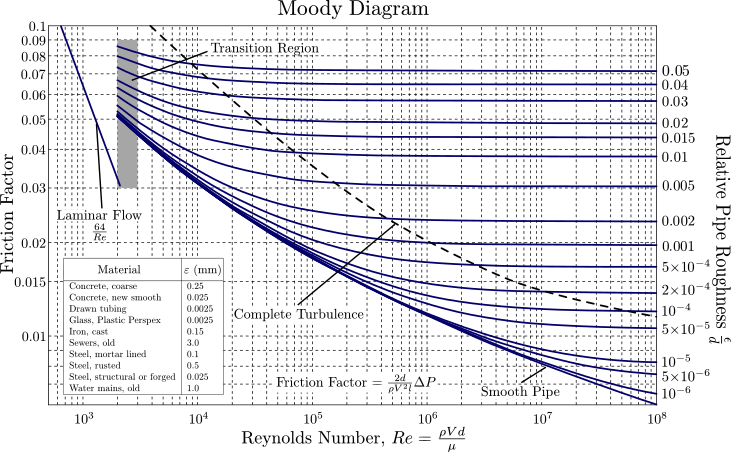

<!-- .slide: data-background="#ffffff" -->
# MME 3303A: Fluid Mechanics  
## Unit 1: Introduction
Instructor: C.T. DeGroot, PhD, PEng  

---
<!-- Section 01: Unit Learning Objectives-->
## Unit Learning Objectives

- Explain the definition of a fluid and differentiate it from a solid.
- Explain the definition of **fluid mechanics** and its importance.
- Identify the main topics in this course and briefly explain their importance to engineering practice.

---
<!-- Section 02: Course Overview-->
## Course Overview

> Let's review the course outline together.

---
<!-- Section 03: Quick Review of Fluid Mechanics -->
## Quick Review of Fluid Mechanics

--
<!-- .slide: class="student-only" -->
## What is a Fluid?

- What is the difference between a fluid and a solid?

--
<!-- .slide: class="instructor-only" -->
## What is a Fluid?

- What is the difference between a fluid and a solid?

> - Solids have a fixed shape; fluids take the shape of their container.
> - Fluids deform continuously under the applicaiton of a shear stress.
> - Both liquids and gases are fluids.
<!-- .element: class="annotation-space" -->

--
## What is Fluid Mechanics?

> **Fluid Mechanics** deals with the behavior of fluids (liquids and gases) in response to forces.

- When a fluid is at rest we are dealing with *fluid statics* or *hydrostatics*
- When a fluid is in motion we are dealing with *fluid dynamics*.

--
<!-- .slide: class="student-only" -->
## Why is Fluid Mechanics Important?

- What are some examples where fluid flow is important?

--
<!-- .slide: class="instructor-only" -->
## Why is Fluid Mechanics Important?

- What are some examples where fluid flow is important?

> - Blood circulation in the human body
> - Airflow over aircraft wings (lift/drag)
> - Cooling systems in engines and electronics
> - Water supply and wastewater systems
> - Atmospheric and oceanic circulation (climate)
<!-- .element: class="annotation-space" -->

--
<!-- .slide: class="student-only" -->
## Why is Fluid Mechanics Important?

- What are the two largest fluid reservoirs on Earth?

--
<!-- .slide: class="instructor-only" -->
## Why is Fluid Mechanics Important?

- What are the two largest fluid reservoirs on Earth?

> - Oceans
> - Atmosphere
<!-- .element: class="annotation-space" -->

---
<!-- Section 04: Course Topics -->
## Course Topics

1.	Introduction
2.	Differential relations for fluid flow
3.	Dimensional analysis
4.	Flow past immersed bodies
5.	Turbomachinery
6.	Introduction to turbulence

--
<!-- .slide: class="student-only" -->
## Differential Analysis

--
<!-- .slide: class="instructor-only" -->
## Differential Analysis

> - Draw a pump and label flow in/out, work in
> - Label this pump **integral analysis**
> - Next, draw the outline of the pump and draw some velocity vectors
> - Label this **differential analysis**
<!-- .element: class="annotation-space" -->

--
## Dimensional Analysis

$$ \Delta p = f_D \frac{\rho V^2}{2}\frac{L}{D} $$

--
## Similarity and Scaling

- Part of dimensional analysis
- Allows us to relate model-scale and full-scale flows

_-_NARA_-_17471593.jpg)

--
## Flow Past Immersed Bodies

- Calculate drag and lift forces on objects

--
## Turbomachinery

  
  

--
## Turbulence

