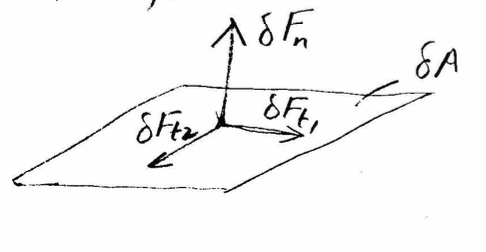
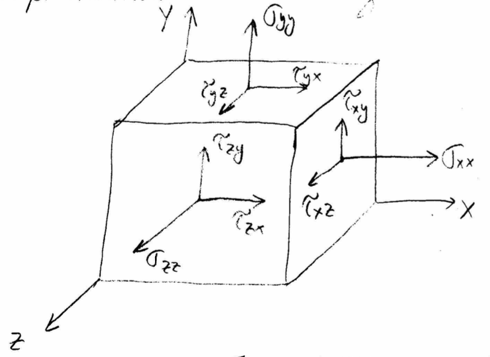
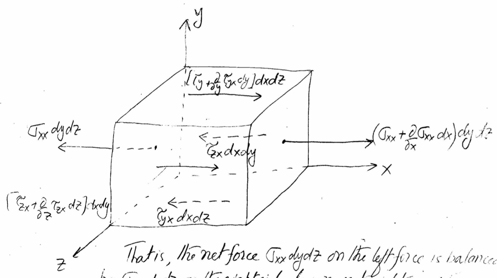

# MME 3303A: Fluid Mechanics  
## Unit 2: Differential Relations for Fluid Flow
## Topic 2: Governing Equations of Fluid Dynamics
Instructor: C.T. DeGroot, PhD, PEng  

---
<!-- Section 01: Unit Learning Objectives-->
## Topic Learning Objectives

- Be able to derive the continuity (conservation of mass) equation in Cartesian coordinates.
- Be able to derive the conservation of momentum equation in Cartesian coordinates.
- Be able to identify the stress components for a general fluid.

---
<!-- Section 02: Continuity Equation-->
<!-- .slide: class="student-only" -->
## Continuity Equation

- Continuity (conservation of mass) equation expresses a mass balance, i.e.:

--
<!-- .slide: class="instructor-only" -->
## Continuity Equation

- Continuity (conservation of mass) equation expresses a mass balance, i.e.:

>- (Rate of change of mass inside control volume) = (Rate of mass flow in through the control surface) - (Rate of mass flow out through the control surface)
<!-- .element: class="annotation-space" -->

-- 
<!-- .slide: class="student-only" -->
## Control Volume and Mass Flows

- Consider an infinitesimal fluid control volume, cubical in shape, in Cartesian
coordinate system.
- Mass flow occurs at all 6 faces (assumed to be 3 inlets and 3 outlets).

-- 
<!-- .slide: class="instructor-only" -->
## Control Volume and Mass Flows

- Consider an infinitesimal fluid control volume, cubical in shape, in Cartesian
coordinate system.
- Mass flow occurs at all 6 faces (assumed to be 3 inlets and 3 outlets).

>- Draw a cube on Cartesian axes. Label sides dx, dy, dz
>- Inflow in x-direction is $\rho u dy dz$, outflow is $\left[\rho u + \frac{\partial(\rho u)}{\partial x} dx\right] dy dz$
>- Inflow in y-direction is $\rho v dx dz$, outflow is $\left[\rho v + \frac{\partial(\rho v)}{\partial y} dy\right] dx dz$
>- Inflow in z-direction is $\rho w dx dy$, outflow is $\left[\rho w + \frac{\partial(\rho w)}{\partial z} dz\right] dx dy$
>- Note that outflow is based on Taylor series (2nd order)
<!-- .element: class="annotation-space" -->

-- 
<!-- .slide: class="student-only" -->
## Mass Balance

- Evaluate control volume mass balance:

-- 
<!-- .slide: class="instructor-only" -->
## Mass Balance

- Evaluate control volume mass balance:

>- $\frac{dm_{cv}}{dt} = \frac{d}{dt} \left( \rho dx dy dz \right) = \frac{\partial\rho}{\partial t}dxdydz$
>- Sub in mass flows:
>- $ \frac{\partial\rho}{\partial t}dxdydz = \rho u dy dz + \rho v dx dz + \rho w dx dy - \left[\rho u + \frac{\partial(\rho u)}{\partial x} dx\right] dy dz - \left[\rho v + \frac{\partial(\rho v)}{\partial y} dy\right] dx dz - \left[\rho w + \frac{\partial(\rho w)}{\partial z} dz\right] dx dy $
>- $\frac{\partial\rho}{\partial t}dxdydz = \frac{\partial(\rho u)}{\partial x} dx dy dz - \frac{\partial(\rho v)}{\partial y} dx dy dz - \frac{\partial(\rho w)}{\partial z} dx dy dz $
>- $ \frac{\partial\rho}{\partial t} = - \frac{\partial(\rho u)}{\partial x} - \frac{\partial(\rho v)}{\partial y} - \frac{\partial(\rho w)}{\partial z} $
>- $ \frac{\partial\rho}{\partial t} + \frac{\partial(\rho u)}{\partial x} + \frac{\partial(\rho v)}{\partial y} + \frac{\partial(\rho w)}{\partial z} = 0 $
>- $ \frac{\partial \rho}{\partial t} + \nabla\cdot(\rho \vec{v}) = 0$
<!-- .element: class="annotation-space" -->

-- 
## Comments on Continuity Equation

- The continuity equation is one of the fundamental equations of fluid mechanics.
- It is valid for all fluid flows including: 
    - Steady and unsteady.
    - Compressible and incompressible.
    - Newtonian and non-Newtonian.
- It expresses the law of conservation of mass at each point in the fluid.
    - Thus, the continuity equation must be satisfied at every point in the flow.
- Any flow that violates the continuity equation cannot exist in nature.

-- 
<!-- .slide: class="student-only" -->
## Incompressible Flow

- For incompressible flow, $\rho$ is constant:

-- 
<!-- .slide: class="instructor-only" -->
## Incompressible Flow

- For incompressible flow, $\rho$ is constant:

>- $ \frac{\partial \rho}{\partial t} + \frac{\partial(\rho u)}{\partial x} + \frac{\partial(\rho v)}{\partial y} + \frac{\partial(\rho w)}{\partial z} = 0 $
>- $ \rho \frac{\partial u}{\partial x} + \rho \frac{\partial v}{\partial y} + \rho \frac{\partial(w)}{\partial z} = 0 $
>- $ \frac{\partial u}{\partial x} + \frac{\partial v}{\partial y} + \frac{\partial(w)}{\partial z} = 0 $
>- $ \nabla\cdot\vec{v} = 0 $
<!-- .element: class="annotation-space" -->

-- 
<!-- .slide: class="student-only" -->
## Steady Flow

- For steady flow, $\frac{\partial\rho}{\partial t} = 0$:

-- 
<!-- .slide: class="instructor-only" -->
## Steady Flow

- For steady flow, $\frac{\partial\rho}{\partial t} = 0$:

>- $ \frac{\partial(\rho u)}{\partial x} + \frac{\partial(\rho v)}{\partial y} + \frac{\partial(\rho w)}{\partial z} = 0  $
>- $ \nabla\cdot(\rho\vec{v}) $ 
<!-- .element: class="annotation-space" -->

-- 
<!-- .slide: class="student-only" -->
## Cylindrical Coordinates

- In cylindrical coordinates:

-- 
<!-- .slide: class="instructor-only" -->
## Cylindrical Coordinates

- In cylindrical coordinates:

>- General:
>- $ \frac{\partial\rho}{\partial t} + \frac{1}{r} \frac{\partial (r\rho v_r)}{\partial r} + \frac{1}{r} \frac{\partial (\rho v_\theta)}{\partial \theta} + \frac{\partial (\rho v_z)}{\partial z} = 0  $
>- Incompressible:
>- $ \frac{1}{r} \frac{\partial (r v_r)}{\partial r} + \frac{1}{r} \frac{\partial v_\theta}{\partial \theta} + \frac{\partial v_z}{\partial z} = 0  $
>- Draw simple cylindrical coordinates; $\theta$ defined from +x axis
<!-- .element: class="annotation-space" -->

---
<!-- Section 03: Momentum Equation-->
<!-- .slide: class="student-only" -->
## Momentum Equation

- The momentum equation is based on Newton's second law of motion, i.e. $F=ma$, applied to the same infinitesimal control volume.

--
<!-- .slide: class="instructor-only" -->
## Momentum Equation

- The momentum equation is based on Newton's second law of motion, i.e. $F=ma$, applied to the same infinitesimal control volume.

>- $ d\vec{F} = dm \vec{a} = dm \frac{d\vec{v}}{dt}$
>- $ d\vec{F} = \rho dx dy dz \left\[ \frac{\partial\vec{v}}{\partial t} + u \frac{\partial\vec{v}}{\partial x} + v \frac{\partial\vec{v}}{\partial y} + w \frac{\partial\vec{v}}{\partial z} \right\] $
>- Need to determine the forces acting on the fluid parcel
<!-- .element: class="annotation-space" -->

--
<!-- .slide: class="student-only" -->
## Body Forces

- Body forces act on the fluid mass in a distributed manner.
- The most common body force is gravity:

--
<!-- .slide: class="instructor-only" -->
## Body Forces

- Body forces act on the fluid mass in a distributed manner.
- The most common body force is gravity:

>- $ d\vec{F}_b = \rho \vec{g} dx dy dz $
<!-- .element: class="annotation-space" -->

--
<!-- .slide: class="student-only" -->
## Surface Forces

- Surface forces act on the surfaces of the fluid parcel (both normal and tangential).
- The most common example is viscous forces.

--
<!-- .slide: class="instructor-only" -->
## Surface Forces

- Surface forces act on the surfaces of the fluid parcel (both normal and tangential).
- The most common example is viscous forces.

>  
>- $\delta F_n = $ Force acting normal to differential area $dA$.
>- $\delta F_{t1,2} = $ Shear forces acting tangential to differential area $dA$ and orthogonal to each other.
<!-- .element: class="annotation-space" -->

--
<!-- .slide: class="student-only" -->
## Normal and Shear Forces

- The normal and shear forces are defined as:

--
<!-- .slide: class="instructor-only" -->
## Normal and Shear Forces

- The normal and shear forces are defined as:

>  - Normal: $\sigma_n = \lim_{\delta A\rightarrow 0}\frac{\delta F_n}{\delta A} $
>  - Shear: $\sigma_n = \lim_{\delta A\rightarrow 0}\frac{\delta F_t}{\delta A} $
<!-- .element: class="annotation-space" -->

--
<!-- .slide: class="student-only" -->
## Stress Components

- There are 9 stress components acting on the fluid element:

- The first subscript represents the direction of the normal to the plane on which the stress acts.
- The second subscript represents the direction in which the stress acts.

--
<!-- .slide: class="instructor-only" -->
## Stress Components

- There are 9 stress components acting on the fluid element:

>  
<!-- .element: class="annotation-space" -->

- The first subscript represents the direction of the normal to the plane on which the stress acts.
- The second subscript represents the direction in which the stress acts.

--
<!-- .slide: class="student-only" -->
## Stress Gradient

- To have a net force on the control volume, a stress gradient is required.
- For the x-direction:

--
<!-- .slide: class="instructor-only" -->
## Stress Gradient

- To have a net force on the control volume, a stress gradient is required.
- For the x-direction:

>  
<!-- .element: class="annotation-space" -->

--
<!-- .slide: class="student-only" -->
## Net Surface Force (x)

- The net surface force in the x-direction is then:

--
<!-- .slide: class="instructor-only" -->
## Net Surface Force (x)

- The net surface force in the x-direction is then:

>- $ dF_{s,x} = \left[ \frac{\partial \sigma_{xx}}{\partial x} + \frac{\partial \tau_{yx}}{\partial y} + \frac{\partial \tau_{zx}}{\partial z}  \right] dx dy dz$
<!-- .element: class="annotation-space" -->

--
<!-- .slide: class="student-only" -->
## Momentum Equation (x)

- Recall, the momentum equation:

$$ d\vec{F} = \rho \left\[ \frac{\partial\vec{v}}{\partial t} + u \frac{\partial\vec{v}}{\partial x} + v \frac{\partial\vec{v}}{\partial y} + w \frac{\partial\vec{v}}{\partial z} \right\] \cdot dx\cdot dy\cdot dz $$

- Adding the total force, in the x-direction

--
<!-- .slide: class="instructor-only" -->
## Momentum Equation (x)

- Recall, the momentum equation:

$$ d\vec{F} = \rho \left\[ \frac{\partial\vec{v}}{\partial t} + u \frac{\partial\vec{v}}{\partial x} + v \frac{\partial\vec{v}}{\partial y} + w \frac{\partial\vec{v}}{\partial z} \right\] \cdot dx\cdot dy\cdot dz $$

- Adding the total force, in the x-direction

>- $ \left[ \rho g_x + \frac{\partial \sigma_{xx}}{\partial x} + \frac{\partial \tau_{yx}}{\partial y} + \frac{\partial \tau_{zx}}{\partial z}  \right] dx dy dz = \rho \left\[ \frac{\partial u}{\partial t} + u \frac{\partial u}{\partial x} + v \frac{\partial u}{\partial y} + w \frac{\partial u}{\partial z} \right\] \cdot dxdydz$
>- $ \rho g_x + \frac{\partial \sigma_{xx}}{\partial x} + \frac{\partial \tau_{yx}}{\partial y} + \frac{\partial \tau_{zx}}{\partial z}  = \rho \left\[ \frac{\partial u}{\partial t} + u \frac{\partial u}{\partial x} + v \frac{\partial u}{\partial y} + w \frac{\partial u}{\partial z} \right\] $
<!-- .element: class="annotation-space" -->

--
<!-- .slide: class="student-only" -->
## Momentum Equations (y, z)

- Similarly in the y- and z- directions:

--
<!-- .slide: class="instructor-only" -->
## Momentum Equations (y, z)

- Similarly in the y- and z- directions:

>- $ \rho g_y + \frac{\partial \tau_{xy}}{\partial x} + \frac{\partial \sigma_{yy}}{\partial y} + \frac{\partial \tau_{zy}}{\partial z}  = \rho \left\[ \frac{\partial v}{\partial t} + u \frac{\partial v}{\partial x} + v \frac{\partial v}{\partial y} + w \frac{\partial v}{\partial z} \right\] $
>- $ \rho g_z + \frac{\partial \tau_{xz}}{\partial x} + \frac{\partial \tau_{yz}}{\partial y} + \frac{\partial \sigma_{zz}}{\partial z}  = \rho \left\[ \frac{\partial w}{\partial t} + u \frac{\partial w}{\partial x} + v \frac{\partial w}{\partial y} + w \frac{\partial w}{\partial z} \right\] $
<!-- .element: class="annotation-space" -->

-- 
## Comments on Momentum Equation

- Along with the continuity equation, the momentum equation governs the flow of fluids.
- It is valid for all fluid flows including: 
    - Steady and unsteady.
    - Compressible and incompressible.
    - Newtonian and non-Newtonian.
- It expresses the law of conservation of momentum at each point in the fluid.
    - Thus, the momentum equation must be satisfied at every point in the flow.

-- 
## Comments on Momentum Equation

- In their current form, we cannot solve these equations. There are too many unknowns:
    - Density (1)
    - Velocity (3)
    - Normal stresses (3)
    - Shear stresses (6)
- 13 total unknowns, but only 4 equations
- We need certain assumptions (e.g., about density and stresses) that reduces the number of unknowns to the number of equations; or we need to add more equations (e.g., equation of state).