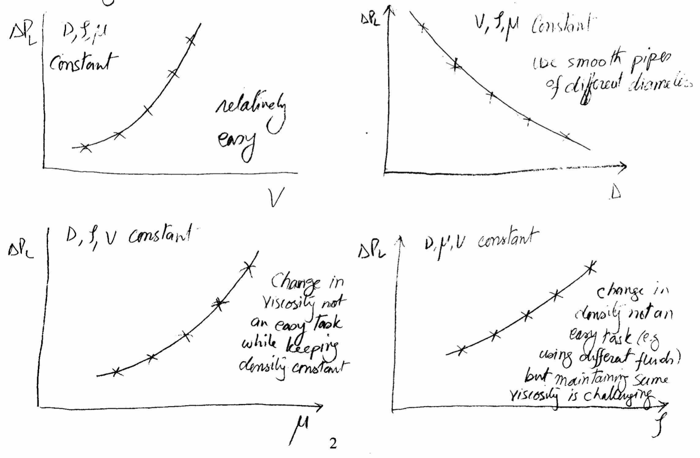
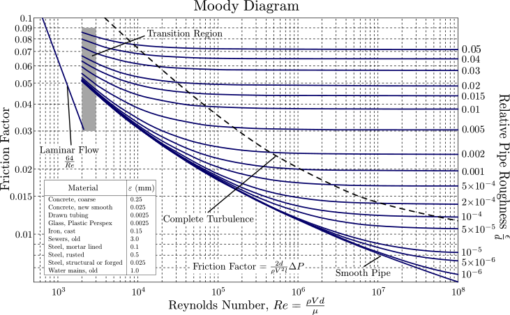

# MME 3303A: Fluid Mechanics  
## Unit 3: Dimensional Analysis and Similarity
## Topic 1: Introduction to Dimensional Analysis
Instructor: C.T. DeGroot, PhD, PEng  

---
<!-- Section 01: Unit Learning Objectives-->
## Topic Learning Objectives

- Understand the purpose of dimensional analysis in reducing the number of variables upon which a problem depends.

---
<!-- Section 02: Overview and Purpose-->
## Overview and Purpose

- Most practical fluid flow problems are too complex, both geometrically and physically
to be solved analytically.
- The analysis of such flow problems relies on experiments.
    - Results are presented as discrete data points which can be used to develop correlations.
    - Data/correlations must be expressed in a compact form to make these results more generally applicable.
    - For example, we do not want to have to conduct experiments for every possible pipe diameter.
- We want to do a limited number of tests on a model system, from which the full-scale behaviour can be inferred.

--
## Dimensional Analysis

- **Dimensional analysis** is a method of reducing the number and complexity of experimental variables that affect a physical phenomenon and grouping them in dimensionless form.
- Advantages of dimensional analysis are:
    1. It reduces the number of variables that need to be measured to understand a phenomenon or a process, which saves time and money.
    2. It helps in thinking about and/or planning for an experiment or theory. It helps to write equations in dimensionless form, which simplifies the analysis.
    3. It provides scaling laws that can convert data obtained from a low-cost, small model experiment to design expensive, large-scale real structures.

---
<!-- Section 03: Reducing the Number of Variables-->
<!-- .slide: class="student-only" -->
## Example - Pipe Flow

- Consider steady, incompressible flow through a smooth circular horizontal pipe.
- As an engineer, you want to experimentally determine the parameters upon which the pressure drop per unit length due to friction depends.
- First, you would decide which variables you think would influence the pressure drop:

--
<!-- .slide: class="instructor-only" -->
## Example - Pipe Flow

- Consider steady, incompressible flow through a smooth circular horizontal pipe.
- As an engineer, you want to experimentally determine the parameters upon which the pressure drop per unit length due to friction depends.
- First, you would decide which variables you think would influence the pressure drop:

>- Pipe diameter ($D$), fluid density ($\rho$), fluid viscosity ($\mu$), mean flow velocity ($V$)
>- Can express this as $\frac{\Delta p}{L} = f(D, \rho, \mu, V)$
<!-- .element: class="annotation-space" -->

-- 
<!-- .slide: class="instructor-only" -->
## iClicker Question

The pressure drop per unit length in a pipe flow, depends on which of the following variables?

A. Pipe Length ($L$)

B. Fluid Density ($\rho$)

C. Gravity ($g$)

D. Fluid Viscosity ($\mu$)

E. Pipe Diameter ($D$)

--
<!-- .slide: class="student-only" -->
## Example - Pipe Flow

- The nature of the function relating the relevant variables to the pressure drop is unknown.
- Experiments would need to be performed systematically to change variables one at a time, while holding all other variables constant and measuring pressure drop.

--
<!-- .slide: class="instructor-only" -->
## Example - Pipe Flow

- The nature of the function relating the relevant variables to the pressure drop is unknown.
- Experiments would need to be performed systematically to change variables one at a time, while holding all other variables constant and measuring pressure drop.

> 
<!-- .element: class="annotation-space" -->

--
## Reducing the Number of Variables

- To get a meaningful relationship between any two variables, we need at least 5-10 data points, i.e., 5-10 experiments.
    - It is practically difficult (and costs a lot of time and money) to perform such a large number of experiments.
    - These results would be specific to those experiments and cannot be generalized.
    - Combining all these data points to get the desired general functional relationship is challenging.
- Through dimensional analysis, these difficulties can be practically eliminated.
    - Instead of working with the original list of variables, we collect these variables into a lesser number of non-dimensional parameters (called dimensionless groups).

--
<!-- .slide: class="student-only" -->
## Dimensionless Groups for Pipe Flow

- The pressure drop can be incorporated into a dimensionless group:

- Recall, the relevant variables are: pipe diameter ($D$), fluid density ($\rho$), fluid viscosity ($\mu$), mean flow velocity ($V$).
- These can be combined into a dimensionless group upon which the pressure drop depends:

--
<!-- .slide: class="instructor-only" -->
## Dimensionless Groups for Pipe Flow

- The pressure drop can be incorporated into a dimensionless group (M=mass, L=length, T=time):

>- $ \frac{\Delta p D}{\rho V^2 L} $
>- Overall units: $\frac{(ML^{-1}T^{-2})(L)}{(ML^{-3})(L^2T^{-2})(L)}$
<!-- .element: class="annotation-space" -->

- Recall, the relevant variables are: pipe diameter ($D$), fluid density ($\rho$), fluid viscosity ($\mu$), mean flow velocity ($V$).
- These can be combined into a dimensionless group upon which the pressure drop depends:

>- $ \frac{\rho V D}{\mu} $
>- Overall units: $\frac{(ML^{-3})(LT^{-1})(L)}{(ML^{-1}T^{-1})}$
<!-- .element: class="annotation-space" -->

--
## Moody Diagram

- The dimensionless groups for pipe flow are how the form of the Moody diagram is found.

