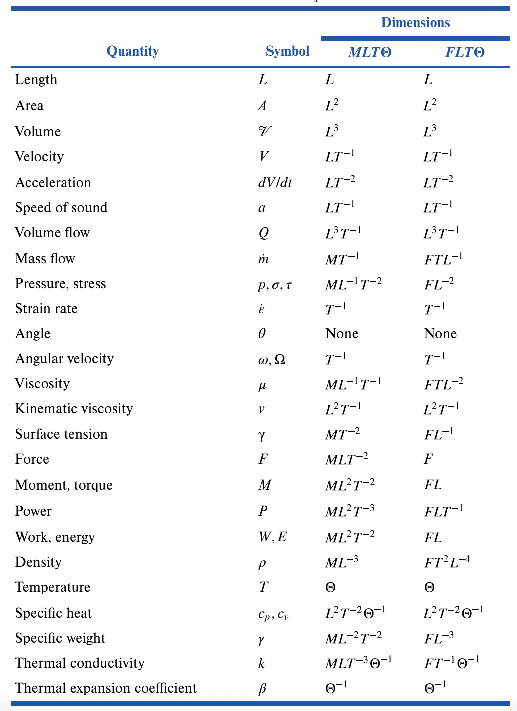

# MME 3303A: Fluid Mechanics  
## Unit 3: Dimensional Analysis and Similarity
## Topic 2: Buckingham Pi Theorem
Instructor: C.T. DeGroot, PhD, PEng  

---
<!-- Section 01: Unit Learning Objectives-->
## Topic Learning Objectives

- Be able to define dimensions and units for common variables used in fluid mechanics.
- Be able to apply Buckingham Pi Theorem to find the dimensionless groups that describe the behaviour of a fluid mechanics system.

---
<!-- Section 02: Basic or Primary Dimensions-->
## Basic or Primary Dimensions

- A **dimension** is the measure by which a physical variable is expressed quantitatively.
- A **unit** is a particular way of identifying the quantitative dimensions. 
    - For example, cm and inch are different *units* for expressing the *dimension* length.
- In fluid mechanics, there are four primary dimensions:
    - Mass [M]
    - Length [L]
    - Time [T]
    - Temperature [$\theta$]
- All other dimensions are derived from these primary dimensions.

--
## Dimensions of Fluid Mechanics Properties

--
## Principle of Dimensional Homogeneity

> *If an equation truly expresses a proper relationship between variables in a physical process, it will be dimensionally homogeneous, i.e. each of its additive terms will have the same dimensions*

- For example, Bernoulli's equation:

$$ \frac{p}{\rho} + \frac{1}{2} V^2 + gz = const $$

- All terms in this equation have the same dimensions [L$^2$T$^{-2}$].

---
<!-- Section 03: Variables and Constants-->
## Basic or Primary Dimensions

- Dimensional Variables: 
    - These are quantities that actually *vary* during a given experiment and would be plotted against each other to show the data. For example, $\Delta p$ and velocity in pipe flow problem. They have dimensions and can be non-dimensionalized.
- Dimensional Constants: 
    - These are quantities that vary from case to case but held constant during a given experiment. For example, in a pipe flow problem, density, viscosity and pipe diameter are held constant during the run. They have dimensions and could be non-dimensionalized.

--
## Basic or Primary Dimensions

- Pure Constants:
    - These have no dimensions and arise from mathematical manipulations, e.g., $\frac{1}{2}$ and the exponent "2" in the expression $\frac{1}{2}\rho V^2$, $\pi$, or the argument to mathematical functions such as $\ln$, $\exp$, $\cos$, $\sin$.
- Angles: 
    - Angles are dimensionless. The preferred unit for an angle is radian, which makes it clear that it is a ratio.
- Counting Numbers: 
    - These are dimensionless. For example, if we wanted to triple the energy to $3E$, 3 is a dimensionless counting number.

---
<!-- Section 04: Choice of Variables and Scaling Parameters-->
## Choice of Variables and Scaling Parameters

- Variables:
    - These are the quantities that we want to vary and plot how they affect each other.
- Scaling Parameters:
    - These are the quantities we use to define our *dimensionless variables*. They are also called *repeating variables*.

--
## Selection of Scaling Parameters

- It is up to the engineer to select scaling parameters, but there are some guidelines:
    - They must not form a dimensionless quantity among themselves, but adding one more variable will form a dimensionless quantity, e.g., $\rho V D$ (dividing by $\mu$ would create a dimensionless quantity).
    - Do not select output variables as scaling parameters, e.g., $\Delta p$ in a pipe flow.
    - Do not select more than one variable with the same dimensions, e.g., $D$ and $L$ in a pipe flow.
    - If convenient, select common scaling parameters, since this are more likely to appear in dimensionless groups.

---
<!-- Section 05: Buckingham Pi Theorem-->
## Buckingham Pi Theorem

- **Buckingham Pi Theorem** theorem (Edgar Buckingham, 1914), is the most commonly used method to reduce the number of dimensional variables into a smaller number of dimensionless groups.
- First part of the theorem:

> *If a physical process satisfies the Principle of Dimensional Homogeneity and involves $n$ dimensional variables, it can be reduced to a relation between $k$ dimensionless variables
or $\Pi$ groups. The reduction $j=n-k$ equals the maximum number of variables that do not form a $\Pi$ group among themselves and is always less than or equal to the number of dimensions describing the variables.* 

--
<!-- .slide: class="student-only" -->
## Pi Theorem Example

- Consider pipe flow:

--
<!-- .slide: class="instructor-only" -->
## Pi Theorem Example

- Consider pipe flow:

>- There are 5 variables ($n=5$): 
>- $\Delta p_L = \frac{\Delta p}{L}$ [$ML^{-2}T^{-2}$]
>- $D$ [$L$]
>- $\rho$ [$ML^{-3}$]
>- $\mu$ [$ML^{-1}T^{-1}$]
>- $V$ [$LT^{-1}$]
>- They are described by 3 dimensions [M, L, T], so $j \le 3$
>- Therefore, $j = n-k = 5- k \le 3 \rightarrow k \ge 2 $, i.e., two dimensionless groups
>- $\Pi_1 = \frac{D\Delta p_L}{\rho V^2}$, $\Pi_2 = \frac{\rho V D}{\mu}$
<!-- .element: class="annotation-space" -->

--
## Buckingham Pi Theorem

- The second part of the theorem shows us how to find the $\Pi$ groups.

> *Find the reduction $j$, then select $j$ scaling variables that do not form a $\Pi$ group among themselves. Each desired $\Pi$ group will be a power product of these $j$ variables plus one additional variable, which is assigned any convenient non-zero exponent. Each $\Pi$ group thus found is independent.* 

--
## Step-by-Step Procedure

1. List and count $n$ variables involved in the problem. If any important variables are missing, dimensional analysis wil fail.
2. List the dimensions of each variable.
3. Find the reduction $j$ and determine the number of $\Pi$ groups to be formed. Initially guess $j$ equal to the number of different dimensions present, and look
for $j$ variables that do not form a $\Pi$ product. If no luck, reduce $j$ by one and look again. With practice you will find $j$ rapidly.

--
## Step-by-Step Procedure

4. Select $j$ scaling parameters that do not form a $\Pi$ product. Try to choose parameters that are general since they will appear in all of the $\Pi$ groups.
5. Add one additional variable to the $j$ repeating variables and form a power product. Algebraically find the exponents that make the product dimensionless. Try to arrange for your output variables to be in the numerator, so that plots will look better. Do this sequentially, adding one new variable each time and you will find all $n-j=k$ desired $\Pi$ products.
6. Write the final dimensionless function, and check the terms to make sure all $\Pi$ groups are dimensionless.

---
<!-- Section 06: Example 1-->
<!-- .slide: class="student-only" -->
## Example 1

A thin rectangular plate having width $w$ and height $h$ is located so that it is normal to the moving stream of fluid. Assume the drag force ($F_p$) that the fluid exerts on the plate is a function of plate width ($w$), plate height ($h$), fluid viscosity ($\mu$), fluid density ($\rho$) and velocity of the fluid stream ($V$). Find the appropriate dimensionless relationship.

--
<!-- .slide: class="instructor-only" -->
## Example 1

A thin rectangular plate having width $w$ and height $h$ is located so that it is normal to the moving stream of fluid. Assume the drag force ($F_D$) that the fluid exerts on the plate is a function of plate width ($w$), plate height ($h$), fluid viscosity ($\mu$), fluid density ($\rho$) and velocity of the fluid stream ($V$). Find the appropriate dimensionless relationship.

>- It is given that $F_D = f(w, h, \mu, \rho, V)$
>- Follow Buckingham Pi Theorem step-by-step.
>- Step 1: List and count $n$ variables involved in the problem ($n=6$).
<!-- .element: class="annotation-space" -->

--
<!-- .slide: class="student-only" -->
## Example 1

--
<!-- .slide: class="instructor-only" -->
## Example 1

>- Step 2: List the dimensions of each variable.
>- $F_D$ [$MLT^{-2}$]
>- $w$ [$L$]
>- $h$ [$L$]
>- $\mu$ [$ML^{-1}T^{-1}$]
>- $\rho$ [$ML^{-3}$]
>- $V$ [$LT^{-1}$]
<!-- .element: class="annotation-space" -->

--
<!-- .slide: class="student-only" -->
## Example 1

--
<!-- .slide: class="instructor-only" -->
## Example 1

>- Step 3: Find the reduction $j$ and determine the number of $\Pi$ groups to be formed. Initially guess $j$ equal to the number of different dimensions present, and look
for $j$ variables that do not form a $\Pi$ product. If no luck, reduce $j$ by one and look again.
>- Dimensions present: [M, L, T], so guess $j=3$.
>- When selecting variables, don't choose both $w$ and $h$ since they have the same dimensions.
>- Don't choose $F_D$ because it is the output.
>- $\mu$ [$ML^{-1}T^{-1}$], $\rho$ [$ML^{-3}$], $V$ [$LT^{-1}$]
<!-- .element: class="annotation-space" -->

--
<!-- .slide: class="student-only" -->
## Example 1

--
<!-- .slide: class="instructor-only" -->
## Example 1

>- Consider:
>- $\mu$ [$ML^{-1}T^{-1}$], $\rho$ [$ML^{-3}$], $V$ [$LT^{-1}$] (could form a $\Pi$ product)
>- $w$ [$L$], $\mu$ [$ML^{-1}T^{-1}$], $\rho$ [$ML^{-3}$] (could not form $\Pi$ product since only $\mu$ contains T)
>- $w$ [$L$], $\mu$ [$ML^{-1}T^{-1}$], $V$ [$LT^{-1}$] (could not form $\Pi$ product since only $\mu$ contains M)
>- $w$ [$L$], $\rho$ [$ML^{-3}$], $V$ [$LT^{-1}$] (could not form $\Pi$ product since only $\rho$ contains M and only $V$ contains T)
>- We were able to find 3 variables, so no need to reduce $j$
<!-- .element: class="annotation-space" -->

--
<!-- .slide: class="student-only" -->
## Example 1

--
<!-- .slide: class="instructor-only" -->
## Example 1

>- Step 4: Select $j$ scaling parameters that do not form a $\Pi$ product. Try to choose parameters that are general since they will appear in all of the $\Pi$ groups.
>- Could choose any of the last 3 from Step 3.
>- Let's choose $w$, $\rho$, $V$.
<!-- .element: class="annotation-space" -->

--
<!-- .slide: class="student-only" -->
## Example 1

--
<!-- .slide: class="instructor-only" -->
## Example 1

>- Step 5: Add one additional variable to the $j$ repeating variables and form a power product. Algebraically find the exponents that make the product dimensionless. Try to arrange for your output variables to be in the numerator, so that plots will look better. Do this sequentially, adding one new variable each time and you will find all $n-j=k$ desired $\Pi$ products.
>- We will have 3 $\Pi$ produces $k=n-j=6-3=3$.
>- Let's add $F_D$ to form $\Pi_1$.
>- $\Pi_1 = w^a \rho^b V^c F_d$
>- $(L)^a(ML^{-3})^b(LT^{-1})^c(MLT^{-2}) = M^0L^0T^0$
>- M: $b+1 = 0 \rightarrow b=-1$
>- T: $-c-2 = 0 \rightarrow c=-2$
>- L: $a-3b+c+1=0 \rightarrow a=-2$
>- $\Pi_1 = \frac{F_D}{\rho V^2  w^2}$
<!-- .element: class="annotation-space" -->

--
<!-- .slide: class="student-only" -->
## Example 1

--
<!-- .slide: class="instructor-only" -->
## Example 1

>- $\Pi_2 = w^a \rho^b V^c h$
>- $(L)^a(ML^{-3})^b(LT^{-1})^c(L) = M^0L^0T^0$
>- M: $b = 0$
>- T: $-c = 0 \rightarrow c=0$
>- L: $a-3b+c+1=0 \rightarrow a=-1$
>- $\Pi_2 = \frac{h}{w}$
<!-- .element: class="annotation-space" -->

--
<!-- .slide: class="student-only" -->
## Example 1

--
<!-- .slide: class="instructor-only" -->
## Example 1

>- $\Pi_3 = w^a \rho^b V^c \mu$
>- $(L)^a(ML^{-3})^b(LT^{-1})^c(ML^{-1}T^{-1}) = M^0L^0T^0$
>- M: $b+1=0 \rightarrow b=-1$
>- T: $-c -1 = 0 \rightarrow c=-1$
>- L: $a - 3b +c -1 = 0 \rightarrow a =-1$
>- $\Pi_3 = \frac{\mu}{\rho V w}$
<!-- .element: class="annotation-space" -->

--
<!-- .slide: class="student-only" -->
## Example 1

--
<!-- .slide: class="instructor-only" -->
## Example 1

>- Step 6: Write the final dimensionless function, and check the terms to make sure all $\Pi$ groups are dimensionless.
>- $ \frac{F_D}{\rho V^2  w^2} = \phi \left( \frac{h}{w}, \frac{\mu}{\rho V w} \right) $
>- $\frac{h}{w}$ is the aspect ratio.
>- $\frac{\rho V w}{\mu}$ is the Reynolds number.
<!-- .element: class="annotation-space" -->

---
<!-- Section 07: Example 2-->
## Example 2

In forced convection, the heat transfer coefficient $h$ is a function of fluid thermal conductivity $k$, fluid density $\rho$, fluid viscosity $\mu$, fluid specific heat $c_p$, fluid
velocity $V$ and body length $L$. Find the appropriate dimensionless relationship using ($k$, $p$, $c_p$, $L$) as repeating variables. Note: Heat transfer coefficient has units of W/(m$^2\cdot$K), thermal conductivity has units of W/(m$\cdot$K) and specific heat has units of J/(kg$\cdot$K).

--
<!-- .slide: class="student-only" -->
## Example 2

--
<!-- .slide: class="instructor-only" -->
## Example 2

>- Step 1: $n=7$.
>- Step 2:
>- $W = \frac{J}{s} = \frac{Nm}{s} = \frac{\frac{kg\cdot m}{s^2} m}{s} = \frac{kg\cdot m^2}{s^3}$
>- $h$ [$MT^{-3}\theta^{-1}$]
>- $k$ [$MLT^{-3}\theta^{-1}$]
>- $\rho$ [$ML^{-3}$]
>- $\mu$ [$ML^{-1}T^{-1}$]
>- $c_p$ [$L^2T^{-2}\theta^{-1}$]
>- $V$ [$LT^{-1}$]
>- $L$ [$L$]
<!-- .element: class="annotation-space" -->

--
<!-- .slide: class="student-only" -->
## Example 2

--
<!-- .slide: class="instructor-only" -->
## Example 2

>- Step 3: j=4 (there are 4 dimensions and scaling parameters are given)
>- Step 4: Scaling parameters are given: ($k$, $p$, $c_p$, $L$)
>- Step 5: $k = n-j = 7-4 = 3$. There are 3 $\Pi$ groups.
<!-- .element: class="annotation-space" -->

--
<!-- .slide: class="student-only" -->
## Example 2

--
<!-- .slide: class="instructor-only" -->
## Example 2

>- $\Pi_1 = k^a \rho^b c_p^c L^d h $
>- $(MLT^-3θ^-1)^a (ML^-3)^b (L²T^-2θ^-1)^c (L)^d (MT^-3θ^-1) = M^0L^0T^0θ^0$
>- M: $a + b + 1 = 0$
>- L: $a - 3b + 2c + d = 0$
>- T: $-3a - 2c - 3 = 0$
>- $\theta$: $-a - c - 1 = 0$
>- Substitute $\theta$ equation ($a = -1 -c$) into T equation:
>- $-3(-1-c) - 2c - 3 = 0 \rightarrow 3 + 3c - 2c = 3 \rightarrow c = 0$
>- Back to T equation, shows $a = -1$
>- M equation: $b=0$
>- L equation: $d=1$
>- $\Pi_1 = \frac{h L}{k}$ (Nusselt number)
<!-- .element: class="annotation-space" -->

--
<!-- .slide: class="student-only" -->
## Example 2

--
<!-- .slide: class="instructor-only" -->
## Example 2

>- $\Pi_2 = k^a \rho^b c_p^c L^d \mu $
>- $(MLT^-3θ^-1)^a (ML^-3)^b (L²T^-2θ^-1)^c (L)^d (ML^-1T^-1) = M^0L^0T^0θ^0$
>- M: $a + b + 1 = 0$
>- L: $a - 3b + 2c + d - 1 = 0$
>- T: $-3a - 2c - 1 = 0$
>- $\theta$: $-a - c = 0$
>- Substitute $\theta$ equation ($a = -c$) into T equation:
>- $-3(-c) - 2c - 1 =0 \rightarrow 3c - 2c = 1 \rightarrow c = 1$
>- Back to T equation, shows $a = -1$
>- M equation: $b=0$
>- L equation: $d = -a + 3b - 2c + 1 = 1 + 0 - 2 + 1 = 0$
>- $\Pi_2 = \frac{\mu c_p}{k}$ (Prandtl number)
<!-- .element: class="annotation-space" -->

--
<!-- .slide: class="student-only" -->
## Example 2

--
<!-- .slide: class="instructor-only" -->
## Example 2

>- $\Pi_3 = k^a \rho^b c_p^c L^d V $
>- $(MLT^-3θ^-1)^a (ML^-3)^b (L²T^-2θ^-1)^c (L)^d (LT^-1) = M^0L^0T^0θ^0$
>- M: $a + b = 0$
>- L: $a - 3b + 2c + d + 1 = 0$
>- T: $-3a - 2c - 1 = 0$
>- $\theta$: $-a - c = 0$
>- Substitute $\theta$ equation ($a = -c$) into T equation:
>- $-3(-c) - 2c - 1 =0 \rightarrow 3c - 2c = 1 \rightarrow c = 1$
>- Back to T equation, shows $a = -1$
>- M equation: $b=1$
>- L equation: $d = -a + 3b - 2c - 1 = 1 + 3 - 2 - 1 = 1$
>- $\Pi_3 = \frac{\rho V L c_p}{k}$ (Péclet number)
<!-- .element: class="annotation-space" -->

--
<!-- .slide: class="student-only" -->
## Example 2

--
<!-- .slide: class="instructor-only" -->
## Example 2

>- Step 6: 
>- $\frac{hL}{k} = \phi \left(\frac{\mu c_p}{k}, \frac{\rho V L c_p}{K} \right)$
>- $Nu = \phi(Pr, Pe)$
>- Note: $Pe = Re Pr$
<!-- .element: class="annotation-space" -->
