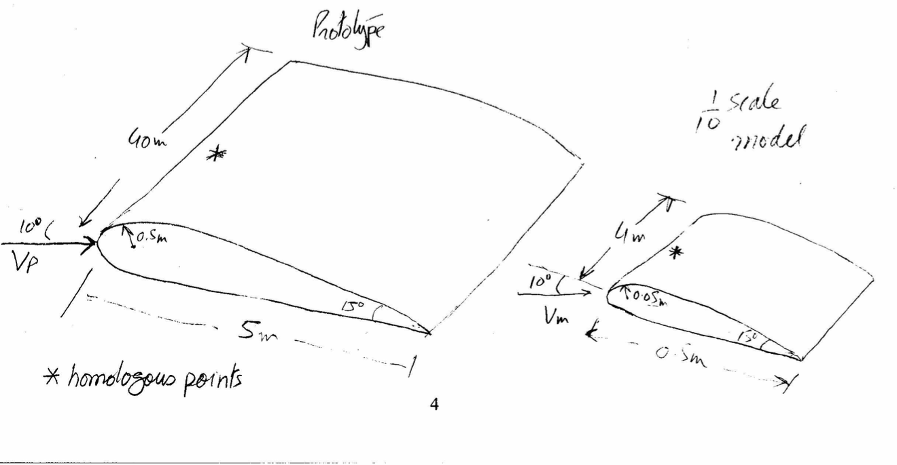
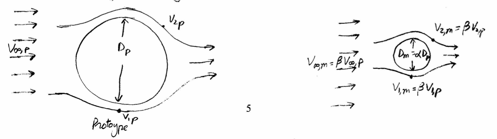

# MME 3303A: Fluid Mechanics  
## Unit 3: Dimensional Analysis and Similarity
## Topic 3: Similarity Analysis
Instructor: C.T. DeGroot, PhD, PEng  

---
<!-- Section 01: Unit Learning Objectives-->
## Topic Learning Objectives

- Understand the requirements for geometric, kinematic, and dynamic similarity.
- Be able to relate the results from a model experiment to a prototype with a different scale. 

---
<!-- Section 02: Scaling Laws-->
## Scaling Laws

- **Scaling laws** provide a way to study the performance of the real, large, and/or expensive systems prior to building them through sufficient testing on inexpensive and small-size models.
- A **model** is a representation of a physical system that may be used to predict the behavior of the system in some desired respect.
- A **prototype** is the physical system for which the predictions are to be made.
- Once the variables are selected and the dimensional analysis is performed, the experimenter seeks to achieve similarity between the model tested and the prototype to be designed.

--
## Scaling Laws

- With sufficient testing, the model data will reveal the desired dimensionless function between variables:

$$ \Pi_1 = f(\Pi_2, \Pi_3, ..., \Pi_n) $$

- Flow conditions for a model test are completely similar if all relevant dimensionless parameters have the same corresponding values for the model and prototype.
- That is, if all of the $\Pi$ groups 2 to $n$ are the same between the model and prototype, then $\Pi_{1,model}= \Pi_{1,prototype}$.

---
<!-- Section 03: Example: Scaling Drag Force-->
<!-- .slide: class="student-only" -->
## Example: Scaling Drag Force

- The force acting on a particular body shape immersed in a stream of fluid depends on the body length scale ($L$), fluid velocity ($V$), fluid density ($\rho$) and fluid viscosity ($\mu$).
- This is similar to the example of a plate, except there is only one length involved.
- Dimensional analysis shows:

--
<!-- .slide: class="instructor-only" -->
## Example: Scaling Drag Force

- The force acting on a particular body shape immersed in a stream of fluid depends on the body length scale ($L$), fluid velocity ($V$), fluid density ($\rho$) and fluid viscosity ($\mu$).
- This is similar to the example of a plate, except there is only one length involved.
- Dimensional analysis shows:

>- $ \frac{F_D}{\rho V^2 L^2} = \phi \left( \frac{\rho V L}{\mu} \right)$
>- $ c_f = \phi (Re) $
<!-- .element: class="annotation-space" -->

--
<!-- .slide: class="student-only" -->
## Example: Scaling Drag Force

-  When the scaling law is valid, we can say that similarity exists between the model and the prototype:

--
<!-- .slide: class="instructor-only" -->
## Example: Scaling Drag Force

-  When the scaling law is valid, we can say that similarity exists between the model and the prototype:

>- All $\Pi$ groups need to match for similarity ($\Pi_2 = Re$)
>- If $\Pi_{2,m} = \Pi_{2,p}$ then $\Pi_{1,m} = \Pi_{1,p}$
>- $\frac{\rho_m V_m L_m}{\mu_m} = \frac{\rho_p V_p L_p}{\mu_p} $
>- $\frac{F_{D,m}}{\rho_m V_m^2 L_m^2} = \frac{F_{D,p}}{\rho_p V_p^2 L_p^2} $
>- $F_{D,p} = \left(\frac{\rho_p}{\rho_m}\right) \left(\frac{V_p}{V_m}\right)^2 \left(\frac{L_p}{L_m}\right)^2 F_{D,m}$ 
>- If we measure the force on the model, then we can use the density, velocity, and length ratios to find the force on the prototype (as long as $Re_m = Re_p$)
<!-- .element: class="annotation-space" -->

---
<!-- Section 04: Types of Similarity-->
## Types of Similarity

- Instead of complete similarity, we often seek particular types of similarity, e.g.:
    - Geometric Similarity.
    - Kinematic Similarity.
    - Dynamic Similarity.

--
# Geometric Similarity

- Geometric similarity concerns the length dimension [L] and must be ensured before any sensible model testing can proceed.
    - *A model and prototype are geometrically similar if and only if all body dimensions in all three coordinates have the same linear ratio.*
- For example, if the model is to be made one-tenth the prototype size, its length, width and height must each be one-tenth as large, and the entire shape must be one-tenth as large.
- Geometric similarity applies to model geometry as well as fluid geometry:
    - *All angles are preserved in geometric similarity. All flow directions are preserved. The orientation of model and prototype with respect to the surroundings must be identical.*

-- 
# Geometric Similarity

- All geometric details must be scaled, including, for example surface roughness.
- Any departure from geometric exact scaling violates geometric similarity and results are not generally comparable. 
    - If there is any differences then the experimenter must justify by experimental comparison to show that the prototype behavior is not significantly affected by the discrepancy.

-- 
<!-- .slide: class="student-only" -->
# Geometric Similarity

-- 
<!-- .slide: class="instructor-only" -->
# Geometric Similarity

> 
<!-- .element: class="annotation-space" -->

--
<!-- .slide: class="student-only" -->
# Kinematic Similarity

- Kinematic similarity requires that the model and prototype have the same length and time scale ratios. That is, the velocity scale ratio will be the same for both (model and prototype).
    - For geometric similarity, homologous points on the model and prototype will have the same relative location.
    - *The motion of two systems are kinematically similar if homologous particles lie at homologous points at homologous times.*

    
--
<!-- .slide: class="instructor-only" -->
# Kinematic Similarity

- Kinematic similarity requires that the model and prototype have the same length scale ratio and the same time scale ratio. That is, the velocity scale ratio will be the same for both (model and prototype).
    - For geometric similarity, homologous points on the model and prototype will have the same relative location.
    - *The motion of two systems are kinematically similar if homologous particles lie at homologous points at homologous times.*
    
> 
<!-- .element: class="annotation-space" -->

--
<!-- .slide: class="student-only" -->
# Kinematic Similarity for Free Surface Flows

- Free surface flows have Froude number (Fr) similarity:

--
<!-- .slide: class="instructor-only" -->
# Kinematic Similarity for Free Surface Flows

- Free surface flows have Froude number (Fr) similarity:

>- $ Fr_m = Fr_p $
>- $ \frac{V_m^2}{gL_m} = \frac{V_p^2}{gL_p} $
>- $ V_m^2 = V_p^2 \frac{L_p}{L_m} $
>- Let $ \alpha = \frac{L_m}{L_p} $
>- $ V_m = \sqrt{\alpha} V_p $
>- Time period, $T = L/V$
>- $ \frac{T_m}{T_p} = \frac{L_m/V_m}{L_p/V_p} = \left(\frac{L_m}{L_p}\right)\left(\frac{V_p}{V_m}\right) = \alpha \frac{1}{\sqrt{\alpha}} = \sqrt{\alpha} $
>- $ T_m = \sqrt{\alpha} T_p $ (same ratio as length scales)
<!-- .element: class="annotation-space" -->

--
## Dynamic Similarity

- Dynamic similarity exists when the model and the prototype have the same length scale ratio, time scale ratio, and force scale (or mass scale) ratio.
    - Must also have geometric and kinematic similarity to have dynamic similarity.
- For dynamic similarity, model and prototype force and pressure coefficients are identical. 

--
<!-- .slide: class="student-only" -->
## Dynamic Similarity

- Dynamic similarity is ensured if:

--
<!-- .slide: class="instructor-only" -->
## Dynamic Similarity

- Dynamic similarity is ensured if:

> | Compressible | Incompressible  | Incompressible    |
> |---|---|---|
> |              | No free surface | With free surface |
> | $ Re_m = Re_p $ | $ Re_m = Re_p$ | $ Re_m = Re_p$ |
> | $ Ma_m = Ma_p $ (Mach) |  | $ Fr_m = Fr_p $ |
> | $ k_m = k_p $ (Spec. Heat Ratio) |  |  |
>- If surface tension is important, Weber number (We) must also be considered:
>- $ We = \frac{\rho V^2 L}{\gamma} $
<!-- .element: class="annotation-space" -->

---
<!-- Section 05: Similarity Issues-->
## Similarity Issues

- Perfect dynamic similarity is extremely difficult to achieve in many practical situations as true equivalence of Reynolds number and Froude number can be achieved only by dramatic changes in fluid properties.
    - Most tests are done in water which is inexpensive and safe to use.

--
<!-- .slide: class="student-only" -->
## Re and Fr Similarity

- Consider how to acheive both Re and Fr similarity:

--
<!-- .slide: class="instructor-only" -->
## Re and Fr Similarity

- Consider how to acheive both Re and Fr similarity:

>- For Fr: $L_m = \alpha L_p$ and $V_m = \sqrt{\alpha}V_p$
>- For Re: $\frac{V_mL_m}{\nu_m} = \frac{V_pL_p}{\nu_p}$
>- $\nu_m = \left(\frac{V_m}{V_p}\right)\left(\frac{L_m}{L_p}\right) = \sqrt{\alpha}\cdot\alpha\nu_p $
>- $\nu_m = \alpha^{3/2}\nu_p$
>- For 1/10 scale model $\alpha=\frac{1}{10}$ and $\alpha^{3/2}=0.032$
>- Not possible to find a fluid with exactly 0.032$\times$ the viscosity of water (assuming prototype is in water).
>- Could extrapolate results based on Re, if appropriate, to solve the problem.
<!-- .element: class="annotation-space" -->