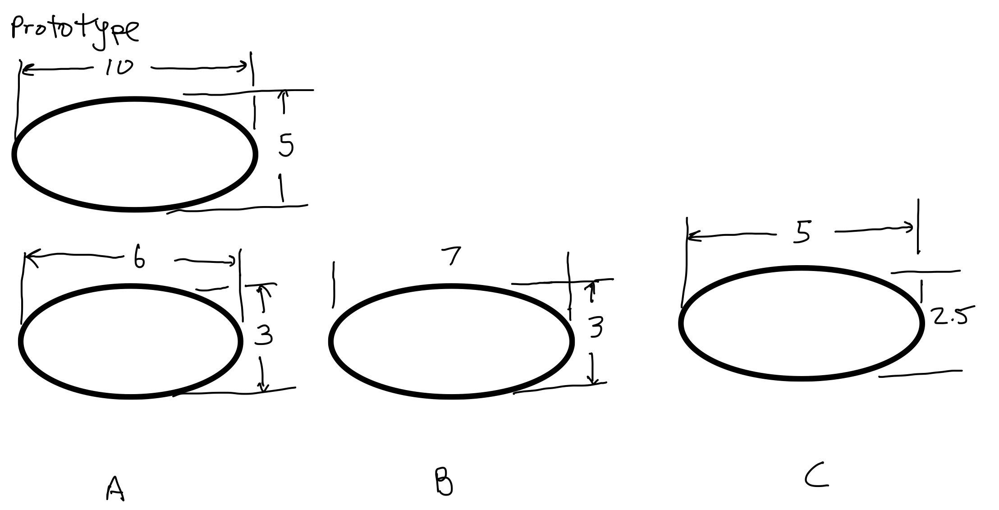
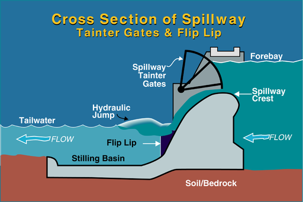

# MME 3303A: Fluid Mechanics  
## Unit 3: Dimensional Analysis and Similarity
## Topic 4: Similarity Analysis Examples
Instructor: C.T. DeGroot, PhD, PEng  

---
<!-- Section 01: Unit Learning Objectives-->
## Topic Learning Objectives

- Be able to solve the problems involving similarity analysis.

---
<!-- Section 02: iClicker Problems-->
<!-- .slide: class="instructor-only" -->
## iClicker Question

- Which of the models are geometrically similar to the prototype?

--
<!-- .slide: class="instructor-only" -->
## iClicker Question

- For modelling flow over a sphere, a 1/10 scale model is used in a wind tunnel. For the full-scale system, which also operates in air at ambient conditions, the velocity should be 10 m/s. What should the velocity be in the wind tunnel?

---
<!-- Section 03: Example 1-->
<!-- .slide: class="student-only" -->
## Example 1

- The drag characteristics of a torpedo are to be studied in a water tunnel using a 1:5 scale model. The tunnel operates with fresh water at 20°C, whereas the prototype torpedo is to be used in sea water at 15.6°C. To correctly simulate the behavior of the prototype moving with a velocity of 30 m/s, what velocity is required in the water tunnel?

--
<!-- .slide: class="instructor-only" -->
## Example 1

- The drag characteristics of a torpedo are to be studied in a water tunnel using a 1:5 scale model. The tunnel operates with fresh water at 20°C, whereas the prototype torpedo is to be used in sea water at 15.6°C. To correctly simulate the behavior of the prototype moving with a velocity of 30 m/s, what velocity is required in the water tunnel?

>- We assume the flow is incompressible and that the torpedo is fully immersed in water (i.e., no free surface).
>- For dynamic similarity we must match the Reynolds number of the model and prototype.
<!-- .element: class="annotation-space" -->

--
<!-- .slide: class="student-only" -->
## Example 1

--
<!-- .slide: class="instructor-only" -->
## Example 1

>- $ Re_p = Re=m \rightarrow \frac{V_m L_m}{\nu_m} = \frac{V_p L_p}{\nu_m} $.
>- $L$ is a characteristic length of the torpedo.
>- $ V_m = \frac{L_p}{L_m}\frac{\nu_m}{\nu_p}V_p $
>- It is given that $ \frac{L_p}{L_m} = 5 $
>- We can look up that $ \nu_m = 1.004\times 10^{-6} m^2/s $ (water at 20C) and  $ \nu_p = 1.17\times 10^{-6} m^2/s $ (sea water at 15.6C)
>- $ V_m = 127.8$ m/s
<!-- .element: class="annotation-space" -->

---
<!-- Section 04: Example 2-->
## Example 2

- A spillway is a section of a dam designed to pass water from the upstream side of the dam to the downstream side. A certain spillway for a dam is 20 m wide and is designed to carry 125 m$^3$/s of water at the flood stage. A 1:15 model is constructed to study the flow characteristics through the spillway. Determine the required width and flow rate of the model to maintain the required similarity.

--
<!-- .slide: class="student-only" -->
## Example 2

--
<!-- .slide: class="instructor-only" -->
## Example 2

>- The width must meet geometric similarity condition, i.e., $\frac{W_p}{W_m} = 15$.
>- $ W_m = \frac{20 m}{15} = 1.33 m$.
>- Flow is incompressible and has a free surface. Must match Fr.
>- $ Fr_m = Fr_p \rightarrow \frac{V_m}{\sqrt{gL_m}} = \frac{V_p}{\sqrt{gL_p}} $
>- $ V_m = \sqrt{\frac{L_m}{L_p}} V_p = \sqrt{\frac{1}{15}} V_p = 0.258 V_p $
>- $ Q = VA = VLW $
>- $ \frac{Q_m}{Q_p} = \frac{V_m A_m}{V_p A_p} = \frac{V_m}{V_p}\frac{L_m W_m}{L_p W_p} = 0.258 \frac{1}{15}\frac{1}{15} = 0.00115 $
>- $ Q_m = 0.144 $ m$^3$/s
<!-- .element: class="annotation-space" -->

---
<!-- Section 05: Example 3-->
<!-- .slide: class="student-only" -->
## Example 3

- The force on the wing of an aircraft at the cruising speed of 600 km/hr is to be determined from testing on a 1:12 scale model. What should be the velocity for the model testing to meet the dynamic similarity condition? Is the velocity realistic to achieve? If not, what would be the other option?

--
<!-- .slide: class="instructor-only" -->
## Example 3

- The force on the wing of an aircraft at the cruising speed of 600 km/hr is to be determined from testing on a 1:12 scale model. What should be the velocity for the model testing to meet the dynamic similarity condition? Is the velocity realistic to achieve? If not, what would be the other option?

>- The flow is incompressible with no free surface so we need to match Re
>- For aerodynamics studies of airfoils, the chord length is the length scale
<!-- .element: class="annotation-space" -->

--
<!-- .slide: class="student-only" -->
## Example 3

--
<!-- .slide: class="instructor-only" -->
## Example 3

>- $ Re_m = Re_p \rightarrow \frac{V_m Lm}{\nu_m} = \frac{V_p L_p}{\nu_p} $
>- $ V_m = \frac{L_p}{L_m}\frac{\nu_m}{\nu_p}V_p $
>- For air at 20C and sea level, $\nu_m = 1.5\times 10^{-6} $ m$^2$/s
>- At cruising altitude -40C and 10,000 m $\rho=$ 0.4125 kg/m$^3$, $\mu=$ 1.51 $\times 10^{-5}$ N/ms
>- $\nu_m = 3.66 1.5\times 10^{-6} $ m$^2$/s
>- $ V_p = 600 km/h = 167 m/s$
>- $ V_m = 821.6 m/s$
>- Not practical. Supersonic.
>- Could test in water with $ \nu_m = 1.005\times 10^{-6} m^2/s $
>- Then, $V_m = 55 m/s$
<!-- .element: class="annotation-space" -->
