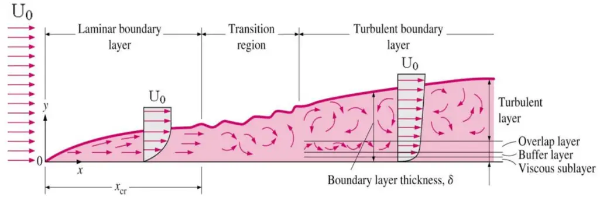
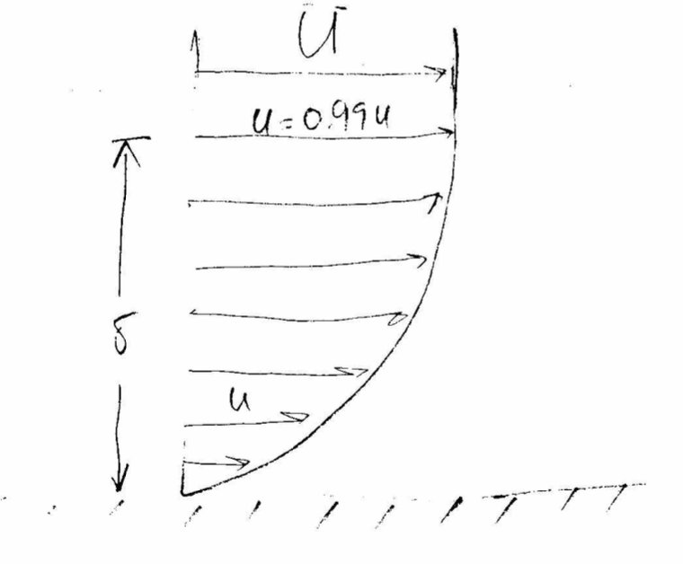
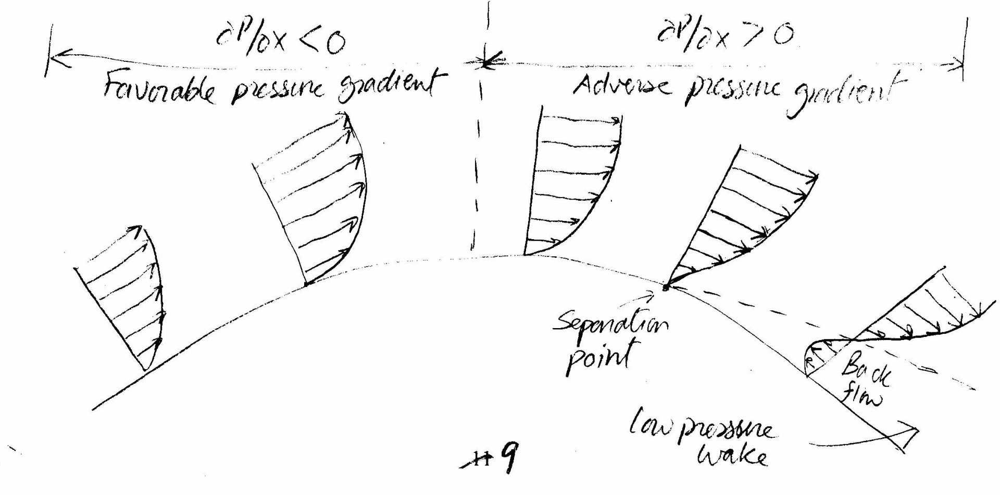

# MME 3303A: Fluid Mechanics  
## Unit 4: Flow Past Immersed Bodies
## Topic 1: Introduction to Boundary Layer Flow
Instructor: C.T. DeGroot, PhD, PEng  

---
<!-- Section 01: Unit Learning Objectives-->
## Topic Learning Objectives

- Be able to identify the key features of boundary layer flow over an object.

---
<!-- Section 02: Flow Past Immersed Bodies-->
## Flow Past Immersed Bodies - Overview

- Flows past immersed bodies in an unbounded fluid are classified as *external flows*.
- An external flow occurs whenever an object moves through a fluid or a fluid passes over an object.
- Such flows are present everywhere in the world around us, both in nature and as a result of modern technology.
- Nearly all living creatures, from smallest bacterium to the largest mammal, encounter air or water in motion.
- Every object on earth is immersed in a fluid either air (atmosphere) or water (ocean and other water bodies).

--
## Application Examples

- Flow past immersed bodies are commonly encountered in engineering applications, including:
    - Aerodynamics: Airplanes, rockets, missiles, projectiles, etc.
    - Hydrodynamics: Ships, submarines, boats, torpedoes, etc.
    - Transportation: Automobile, trains, bicycles, etc.
    - Wind Engineering: Buildings, bridges, wind turbines, transmission lines, etc.
    - Ocean Engineering: Buoys, offshore platforms, etc.

-- 
# Application Examples

- The fluid forces of lift and drag have a significant impact on performance in the applications listed.
- Better understanding of the flow field around bodies in motion will improve their design, e.g.:
    - Increasing stability, decreasing fuel consumption, etc.
- The flow around structures (e.g., buildings and bridges) is another important application.
    - Proper design of buildings and bridges includes consideration of wind effects.

--
## Analysis Approach

- Like other types of fluid flows, the analysis of external flows involves theoretical, numerical, and experimental approaches.
- Due to complexities the amount of information obtained from purely theoretical methods is limited.
- Much of the information about external flows comes from experiments carried out mostly on scale models of the actual objects.
- Such testing includes the wind tunnel testing of model airplanes, automobiles, buildings, etc.
- In some cases, the actual device, not a model is tested in very large wind tunnels.

--
## Characteristics of Flow past an Object

- The characteristics of the flow field is a function of the shape of the body.
- For a given shape of an object, the characteristics of the flow depends very strongly on various parameters such as size, orientation, speed, and fluid properties.
- For typical external flows, the most important of these parameters are the Reynolds number and the Mach number.
    - If the Reynolds number is very low, the viscous effects are significant over a larger extent around the object.
    - If the Reynolds number is high, the flow is dominated by the inertial effects and the viscous effects are negligible everywhere except the region very close to the solid surface.

---
<!-- Section 03: Boundary Layers-->
<!-- .slide: class="student-only" -->
## Boundary Layers

- Consider the flow over a flat surface immersed in an unbounded flow domain.

--
<!-- .slide: class="instructor-only" -->
## Boundary Layers

- Consider the flow over a flat surface immersed in an unbounded flow domain.

<!-- .element: class="annotation-space" -->

--
## Boundary Layers

- The flow approaching the surface is at a uniform velocity, also called *free-stream velocity* ($U$, $U_0$ or $U_\infty$).
- When the flow reaches the surface, due to the no-slip condition, the flow velocity becomes zero at the surface and increases with the distance from the surface until it becomes equal to the free-stream velocity.
- The region in which the velocity varies from zero to free-stream velocity, i.e. the viscous region, is called the *boundary layer*.
- Boundary layer is the region adjacent to a surface in which viscous (shear) stresses are present.
    - That is, velocity gradients exist in the boundary layer, and they vanish outside of the boundary layer.

--
## Boundary Layers

- Initially a laminar boundary layer forms, then, as the distance from the stagnation point increases, the transition from laminar to turbulent flow occurs and it becomes a turbulent boundary layer.
- The main factors that affect the boundary layer transition include, pressure gradient, surface roughness, heat transfer, body forces, free stream disturbances, etc.
- To develop a solution for boundary layers, we consider the simplest case, that is, one in which the boundary layer is formed on an infinitely long flat plate due to the flow of a viscous and incompressible fluid.

--
## Flat Plate Boundary Layer 

- For boundary layer flow over a flat plate, we consider a constant velocity $U$ outside of the boundary layer.
- Since this outer region is steady, inviscid and incompressible, the pressure will also be constant.
- This constant pressure is the pressure felt by the boundary layer. Thus, the flow is considered to be the *zero pressure gradient flow*.

--
## Flat Plate Boundary Layer 

- For flow over a flat surface, the local Reynolds number ($Re_x$) is defined as,

$$\text{Re}_x = \frac{Ux}{\nu}$$

- $x$ is the distance from the leading edge of the plate.
- For incompressible flow over a smooth plate with zero pressure gradient, in the absence of heat transfer, the transition from laminar to turbulent flow in the boundary layer begins at about $\text{Re}_x \approx 1 \times 10^5$. It becomes fully turbulent around $\text{Re}_x \approx 3 \times 10^6$.
- In engineering analysis, a generally accepted value for the critical Reynolds number is, $\text{Re}_{x,cr} \approx 5 \times 10^5$

--
## Boundary Layer Thickness

- As mentioned earlier, in a boundary layer, the fluid velocity changes from zero at the object surface to $U$ at the upper edge of the boundary layer.
- The distance from the object surface to this upper edge is called the boundary layer thickness.
- However, the location of this upper edge is not very obvious.
- Therefore, there are several boundary layer definitions have been developed.

--
<!-- .slide: class="student-only" -->
## Boundary Layer Thickness
- In most boundary layer analysis, we define boundary layer thickness as the *disturbance thickness*, $\delta$.
    - It is defined as the distance from the surface at which the boundary layer velocity, $u$, is within 1% of the free stream velocity, i.e., $u = 0.99U$.

--
<!-- .slide: class="instructor-only" -->
## Boundary Layer Thickness
- In most boundary layer analysis, we define boundary layer thickness as the *disturbance thickness*, $\delta$.
    - $\delta$ is defined as the distance from the surface at which the boundary layer velocity, $u$, is within 1% of the free stream velocity, i.e., $u = 0.99U$.

<!-- .element: class="annotation-space" -->

--
<!-- .slide: class="student-only" -->
## Laminar Flat-Plate Boundary Layer: Exact Solution

--
<!-- .slide: class="instructor-only" -->
## Laminar Flat-Plate Boundary Layer: Exact Solution

>- Assume: (i) $ u \rightarrow U$ at $ y = \delta $ (ii) $\frac{\partial u}{\partial y}\rightarrow 0$ at $ y = \delta $
>- Further, assume: (i) $u \ll v$ (ii) $ \frac{\partial u}{\partial x} \ll \frac{\partial u}{\partial y} $ (iii) $ \frac{\partial v}{\partial x} \ll \frac{\partial v}{\partial y}$, (iv) $ Re_x \gg 1 $
>- Governing equations are reduced to:
>- $ \frac{\partial u}{\partial x} + \frac{\partial v}{\partial y} = 0 $ (Continuity)
>- $ u \frac{\partial u}{\partial x} + v \frac{\partial u}{\partial y} = \nu \frac{\partial^2 u}{\partial y^2} $ (x-momentum)
>- Boundary conditions are:
>- $ u = v = 0 $ at $ y = 0 $
>- $ u = U $, $ v = 0 $, $ \frac{\partial u}{\partial y} = 0 $ at $ y = \delta $
<!-- .element: class="annotation-space" -->

-- 
## Laminar Flat-Plate Boundary Layer: Exact Solution

- The solution for the laminar boundary layer on a horizontal flat plate was obtained by H. Blasius in 1908. This solution is also referred to as *Blasius solution*.
- Blasius found that if the velocity profile in the normalized form i.e. $u/U$ is plotted versus the normalized distance from the surface, i.e. $y/\delta$, all the velocity profiles at different $x$ locations, fall into a single curve.

-- 
## Laminar Flat-Plate Boundary Layer: Exact Solution

- Through non-dimensionalizing the variables and by introducing the stream function, the Navier-Stokes equation was transformed into new coordinates with one dependent variable $(f)$ and one independent variable $(\eta)$.
- That is, a second-order nonlinear partial differential equation was transformed into a third-order nonlinear ordinary differential equation.

$$2 \frac{d^3f}{d\eta^3} + f\frac{d^2f}{d\eta^2} = 0$$

-- 
## Laminar Flat-Plate Boundary Layer: Exact Solution

$$ \eta(x,y) = y \left(\frac{U}{\nu x}\right)^{1/2} $$

$$ f^\prime(\eta) = \frac{u}{U} $$

- Boundary conditions:
    - $ f = f^\prime = 0 $ at $ \eta = 0$
    - $ f^\prime \rightarrow 1 $ as $ \eta \rightarrow \infty$

- These equations are solved numerically.

--
## Blasius Solution Results 

| $\eta = y(U_\infty/\nu x)^{1/2}$ | $f(\eta)$ | $f'(\eta)$ | $f''(\eta)$ |
|---------------|------|-------|--------|
| 0.0 | 0.0000 | 0.0000 | 0.3321 |
| 1.0 | 0.1656 | 0.3298 | 0.3230 |
| 2.0 | 0.6500 | 0.6298 | 0.2668 |
| 3.0 | 1.3968 | 0.8460 | 0.1614 |
| 4.0 | 2.3058 | 0.9555 | 0.0642 |
| 5.0 | 3.2833 | 0.9915 | 0.0159 |
| $\infty$ | $\infty$ | 1.0000 | 0.0000 |

-- 
## Blasius Solution Results 

- Boundary layer thickness:
$$ \delta(x) = \frac{5.0}{\left(\frac{U}{\nu x}\right)^{1/2}} \rightarrow \frac{\delta}{x} = \frac{5.0}{Re_x^{1/2}} $$
- Wall shear stress:
$$ \tau_{w,x} = \frac{0.332 \rho U^2}{Re_x^{1/2}} $$
- Skin friction coefficient: 
$$ c_{f,x} = \frac{\tau_{w,x}}{\frac{1}{2} \rho U^2} = \frac{0.664}{Re_x^{1/2}} $$

--
## Blasius Solution Results

- Key conclusions:
    - Boundary layer thickness grows proportional $x^{1/2}$.
    - Wall shear stress and skin friction coefficient reduce proportional to $x^{-1/2}$.

--
## Turbulent Boundary Layer

- No analytical solution is available for a turbulent boundary layer. 
    - Thus, we have to rely on experimental observations.
- For a turbulent boundary layer on a flat plate:
    - Boundary thickness:
$$ \frac{\delta}{x} = \frac{0.16}{Re_x^{1/7}}$$
    - Skin friction coefficient:
$$ c_{f,x} = \frac{0.026}{Re_x^{1/7}} $$

- Turbulent BL develops more rapidly than laminar BL ($Re_x^{-1/7}$ vs. $Re_x^{-1/2}$).

--
## Average Skin Friction Coefficient

- While $c_f$ changes with $x$, in engineering applications, we are often interested in the average value of $c_f$ over the plate length.
- Thus, average skin friction coefficient can be computed as:

$$ c_f = \frac{1}{L}\int_0^L C_{f,x} dx, \quad \text{where } L \text{ is the plate length} $$

- $c_f = 1.328/Re_L^{1/2}$ for laminar flow ($Re_L < 5 \times 10^5$)
- $c_f = 0.0303/Re_L^{1/7}$ for turbulent flow ($5 \times 10^5 < Re_L < 10^7$)

---
<!-- Section 04: Example 1-->
## Example 1

Air at 10 m/s approaches a smooth flat surface and passes over it. Determine, (i) how far from the leading edge the boundary layer will transition to turbulent, (ii) the thickness of boundary layer and skin friction coefficient 1 m downstream of this location, (iii) the boundary layer thickness and skin friction coefficient at the same location as in (ii) if the free-stream air velocity decreases to 1.5 m/s? Consider the kinematic viscosity of air equal to 1.516 $\times$ 10$^{-5}$ m$^2$/s.

--
<!-- .slide: class="student-only" -->
## Example 1

-- 
<!-- .slide: class="instructor-only" -->
## Example 1

>- Part (i)
>- As discussed earlier, over a flat plate, the boundary layer transitions to turbulent at a critical Reynolds number, $Re_{x,cr} = 5 \times 10^5$
>- Recall, $Re_x = \frac{Ux}{\nu}$
>- As given, $U = 10$ m/s and $\nu = 1.516 \times 10^{-5}$ m²/s
>- Thus, $x = \frac{Re_x \nu}{U} = \frac{(5 \times 10^5)(1.516 \times 10^{-5})}{10} \Rightarrow \boxed{x = 0.76 \text{ m}}$
<!-- .element: class="annotation-space" -->

--
<!-- .slide: class="student-only" -->
## Example 1

--
<!-- .slide: class="instructor-only" -->
## Example 1
>- Part (ii)
>- At any downstream distance, the boundary layer remains turbulent. Hence, we have to use the relations for turbulent boundary layer. But first we need to determine $Re_x$ at this location.
>- $Re_x = \frac{Ux}{\nu} = \frac{(10)(0.76+1)}{1.516 \times 10^{-5}} = 1160950$
>- $\delta = \frac{0.16x}{Re_x^{1/7}} = \frac{(0.16)(1.76)}{(1160950)^{1/7}} = 0.038 \text{ m} \Rightarrow \boxed{\delta = 3.8 \text{ cm}}$
>- $c_{f,x} = \frac{0.026}{Re_x^{1/7}} = \frac{0.026}{(1160950)^{1/7}} \Rightarrow \boxed{c_{f,x} = 0.0035}$
<!-- .element: class="annotation-space" -->

--
<!-- .slide: class="student-only" -->
## Example 1

--
<!-- .slide: class="instructor-only" -->
## Example 1

>- Part (iii)
>- For $U = 1.5$ m/s, $Re_x = \frac{(1.5)(1.76)}{1.516 \times 10^{-5}} = 1.74 \times 10^5$ (Laminar)
>- Using relations for laminar boundary layer:
>- $\delta = \frac{5x}{\sqrt{Re_x}} = \frac{(5)(1.76)}{(1.74 \times 10^5)^{1/2}} = 0.007 \text{ m} \Rightarrow \boxed{\delta = 2 \text{ cm}}$
>- $c_{f,x} = \frac{0.664}{\sqrt{Re_x}} = \frac{0.664}{(1.74 \times 10^5)^{1/2}} \Rightarrow \boxed{c_{f,x} = 0.0016}$
<!-- .element: class="annotation-space" -->

---
<!-- Section 05: Example 2-->
## Example 2

Aerial advertising is a common technique where a small airplane flies the advertisement banner. Consider a small airplane flying at a speed of 150 km/hr, carries a very thin rectangular banner 5 m high and 10 m long. Determine, (i) average skin friction coefficient, (ii) drag force exerted by wind, and (iii) extra power required by the airplane to fly the banner. Ignore any effect of connecting strings. For air, consider, $\rho$ = 1.2 kg/m$^3$ and $\mu$ = 1.9 $\times$ 10$^{-5}$ kg/ms.

--
<!-- .slide: class="student-only" -->
## Example 2

--
<!-- .slide: class="instructor-only" -->
## Example 2

>- Part(i)
>- When the banner is oriented parallel to the flow, the drag comes only from skin friction. Thus, in order to estimate $C_f$, we need to know if the boundary layer is laminar or turbulent.
>- $Re_L = \frac{\rho VL}{\mu} = \frac{(1.2)(41.7)(10)}{1.9 \times 10^{-5}} = 26,336,842$
>- Since $Re_L > Re_{cr}$, the boundary layer is turbulent. Therefore, use the relation for turbulent boundary layer:
>- $c_f = \frac{0.031}{Re_L^{1/7}} = \frac{0.031}{(26,336,842)^{1/7}} \Rightarrow \boxed{C_f = 0.0027}$
<!-- .element: class="annotation-space" -->

--
<!-- .slide: class="student-only" -->
## Example 2

--
<!-- .slide: class="instructor-only" -->
## Example 2

>- Part(ii)
>- To find the drag, we need to determine the shear stress from the relation:
>- $c_f = \frac{\tau_w}{\frac{1}{2}\rho V^2}$
>- $\tau_w = c_f \left(\frac{1}{2}\rho V^2\right) = (0.0027)\left(\frac{1}{2}\right)(1.2)(41.7)^2 = 2.82 \text{ N/m}^2$
>- $F_D = \tau_w \times A = (2.82)(2 \times 5 \times 10) \Rightarrow \boxed{F_D = 282 \text{ N}}$
>- Note: Factor of 2 accounts for both sides of the banner.
<!-- .element: class="annotation-space" -->

--
<!-- .slide: class="student-only" -->
## Example 2

--
<!-- .slide: class="instructor-only" -->
## Example 2

>- Part(iii)
>- Power $= F_D \times V = (282)(41.7) \Rightarrow \boxed{P = 11,759 \text{ W} \approx 11.8 \text{ kW}}$

---
<!-- Section 06: Pressure Gradients-->
## Pressure Gradients in Boundary Layer Flows

- In flows over a flat surface with zero pressure gradient, the fluid particles in the boundary layer are slowed down only by the shear stress (viscous effects) leading to the boundary layer growth.
- However, when the flow goes over an object other than a flat surface, the pressure field is not uniform. 
    - That is, the pressure gradients exist for flow past all bodies except a flat surface.
- The pressure gradient normal to the surface is usually very small and thus, neglected.

--
## Pressure Gradients in Boundary Layer Flows

- A **favorable pressure gradient:** is where the pressure decreases in the direction of the flow (i.e. $\partial p/\partial x < 0$).
    - It arises when the free-stream velocity is increasing in the $x$-direction e.g. converging flow
    - A favorable pressure gradient tends to counteract the slowing of the fluid particles in the boundary layer.
- An **adverse pressure gradient:** is where the pressure increases in the direction of flow (i.e. $\partial p/\partial x > 0$).
    - Adverse pressure gradient arises when the free-stream velocity is decreasing in the $x$-direction e.g. diverging flow
    - An adverse pressure gradient tends to contribute to the slowing of the fluid particles in the boundary layer.

--
<!-- .slide: class="student-only" -->
## Pressure Gradients in Boundary Layer Flows

--
<!-- .slide: class="instructor-only" -->
## Pressure Gradients in Boundary Layer Flows

<!-- .element: class="annotation-space" -->

--
## Pressure Gradients in Boundary Layer Flows

- If adverse pressure gradient is severe enough, the fluid particles in the boundary layer will actually brought to rest.
    - When this occurs, the particles are forced away from the body surface as to make room for the following particles.
- This phenomenon is called the *flow separation*.
- Note that when we have an adverse pressure gradient, flow separation is possible but not guaranteed.
    - An adverse pressure gradient is a necessary condition for flow separation to occur, but there is not always a flow separation when there is an adverse pressure gradient.

--
## Video Examples

- [Flow separation over an airfoil.](https://youtu.be/SiOiVHUEYao?si=ljjByEgHJhHzyDaW)
- [Stall of an airplane wing.](https://youtu.be/yK7zz3PeNrU?si=B1QRB-jHix2c9huB)

---
<!-- Section 07: Other Definitions of Boundary Layer Thickness-->
## Other Definitions of Boundary Layer Thickness

- **Displacement Thickness** ($\delta^*$)
    - Due to viscous effects, the flow velocities are lower in the boundary layer; this is considered as the *velocity deficit* compared to the free-stream velocity.
    - The displacement thickness is defined as the increase in the height of the solid boundary such that the mass flow rate within this thickness under inviscid conditions is the same as the mass flow rate deficit in the actual boundary layer.

--
<!-- .slide: class="student-only" -->
## Displacement Thickness

--
<!-- .slide: class="instructor-only" -->
## Displacement Thickness

>- Mass flow rate through boundary layer (actual):
>- $\dot{m}_{actual} = \int_0^\delta \rho u \, dy$
>- Mass flow rate through boundary layer (inviscid):
>- $\dot{m}_{inviscid} = \int_0^\delta \rho U \, dy = \rho U \delta$
>-  Mass flow rate deficit:
>- $\dot{m}_{deficit} = \int_0^\delta \rho U \, dy - \int_0^\delta \rho u \, dy = \int_0^\delta \rho(U - u) \, dy$
>- Mass flow rate through displacement thickness (inviscid):
>- $\dot{m}_{inviscid,\delta^*} = \rho U \delta^*$
>- Setting equal:
>- $\rho U \delta^* = \int_0^\delta \rho(U - u) \, dy$
>- $\boxed{\delta^* = \int_0^\delta \left(1 - \frac{u}{U}\right) dy}$
<!-- .element: class="annotation-space" -->

--
## Other Definitions of Boundary Layer Thickness

- **Momentum Thickness** ($\theta$)
    - The momentum thickness is defined as an increase in the height of the solid boundary such that the momentum within this thickness under inviscid conditions is the same as the momentum deficit in the boundary layer.

--
<!-- .slide: class="student-only" -->
## Momentum Thickness

--
<!-- .slide: class="instructor-only" -->
## Momentum Thickness

>- Momentum flux through boundary layer (actual):
>- $\dot{M}_{actual} = \int_0^\delta \rho u \cdot u \, dy = \int_0^\delta \rho u^2 \, dy$
>- Momentum flux through boundary layer (inviscid):
>- $\dot{M}_{inviscid} = \int_0^\delta \rho U \cdot U \, dy = \rho U^2 \delta$
>- Momentum flux deficit:
>- $\dot{M}_{deficit} = \int_0^\delta \rho U^2 \, dy - \int_0^\delta \rho u^2 \, dy = \int_0^\delta \rho(U^2 - u^2) \, dy$
>- $\dot{M}_{deficit} = \int_0^\delta \rho U(U - u) \, dy = \int_0^\delta \rho u(U - u) \, dy$
>- Momentum flux through momentum thickness (inviscid):
>- $\dot{M}_{inviscid,\theta} = \rho U^2 \theta$
>- Setting equal:
>- $\rho U^2 \theta = \int_0^\delta \rho u(U - u) \, dy \rightarrow \boxed{\theta = \int_0^\delta \frac{u}{U}\left(1 - \frac{u}{U}\right) dy}$
<!-- .element: class="annotation-space" -->