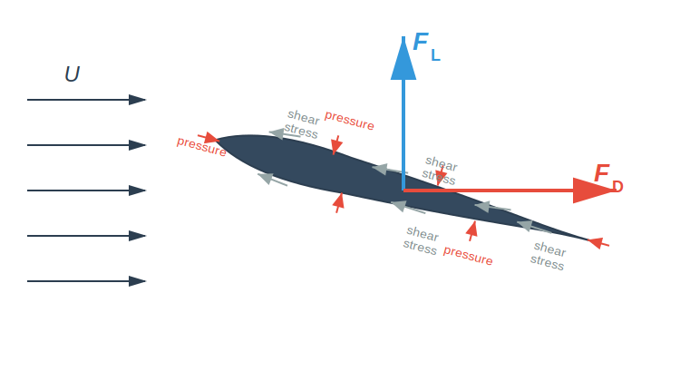
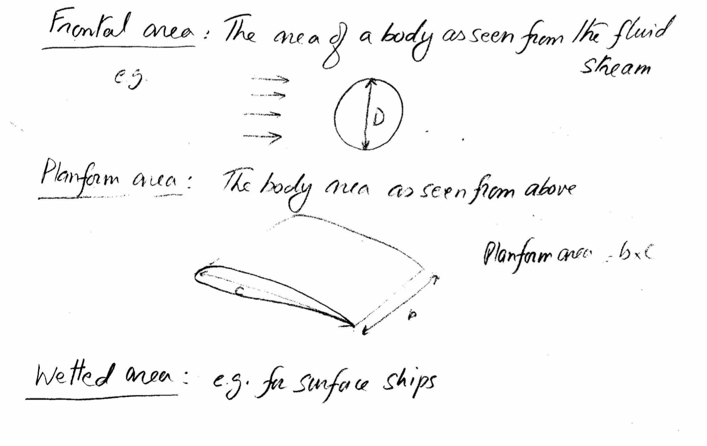
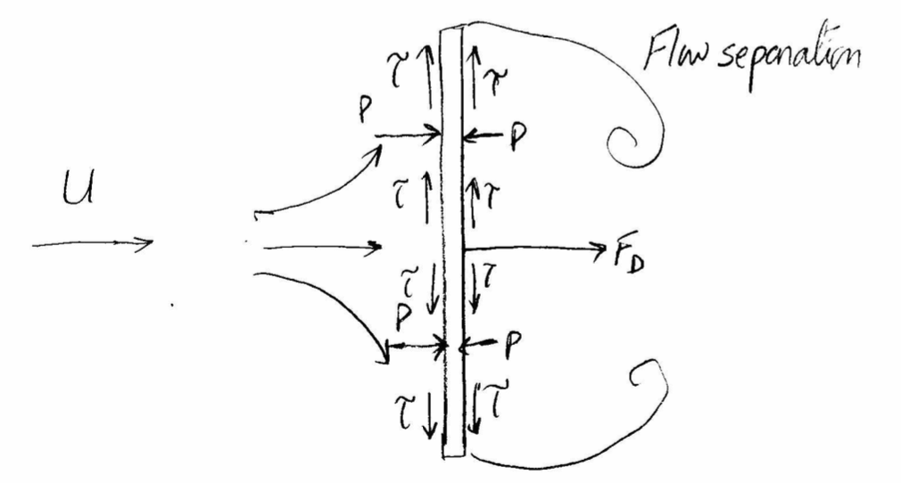
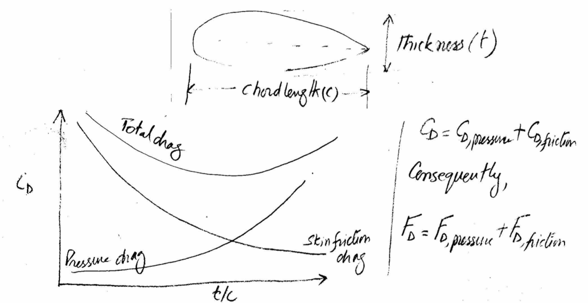
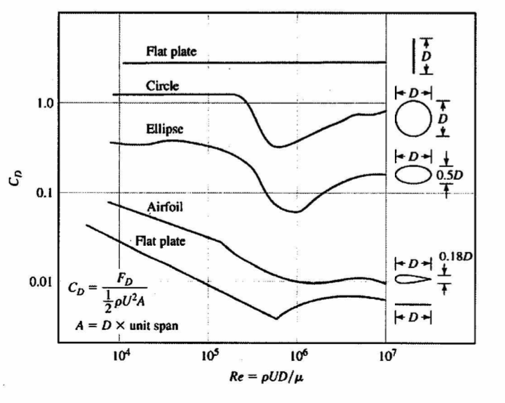
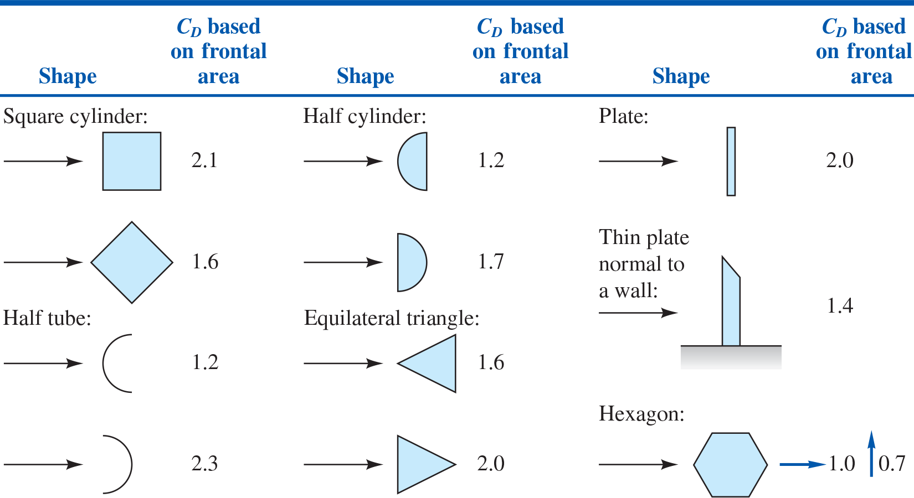
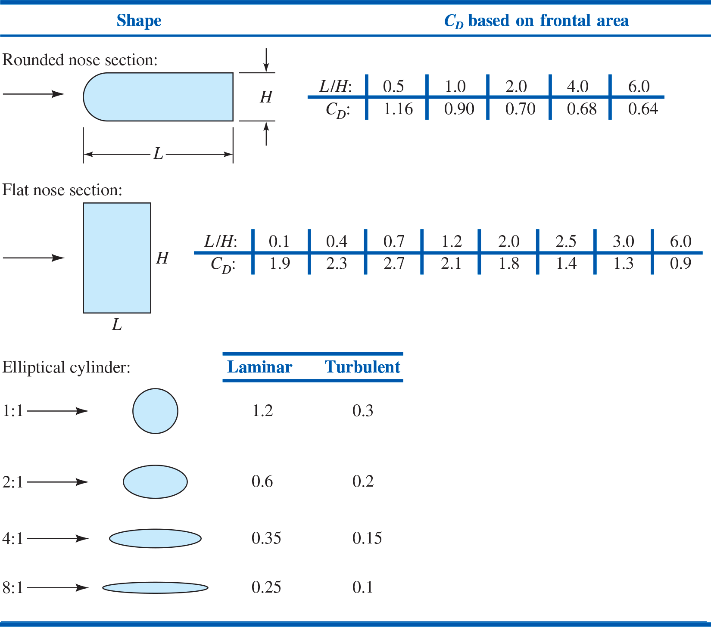
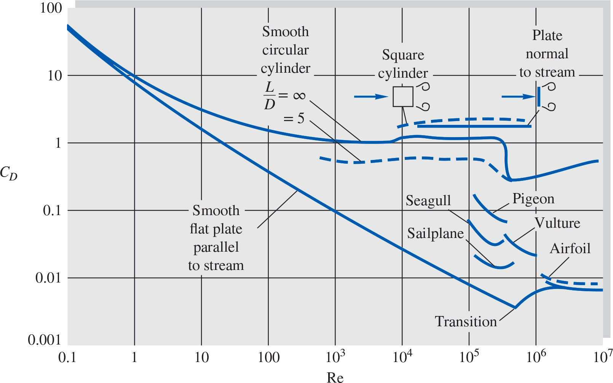
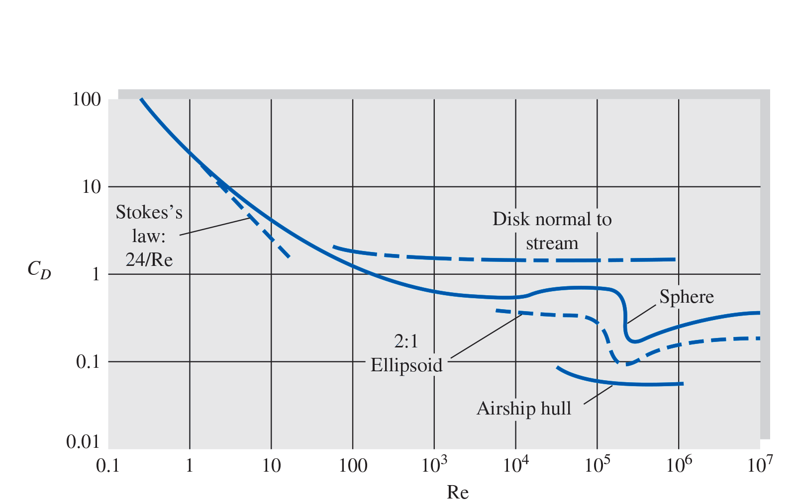

# MME 3303A: Fluid Mechanics II
## Unit 4: Flow Past Immersed Bodies
## Topic 2: Drag Force
Instructor: C.T. DeGroot, PhD, PEng  

---
<!-- Section 01: Topic Learning Objectives-->
## Topic Learning Objectives

- Understand the concepts of drag force and lift force on immersed bodies.
- Be able to calculate drag force for various object shapes.
- Understand how drag coefficient varies with Reynolds number and object shape.

---
<!-- Section 02: Flow Past Immersed Bodies-->
## Flow Past Immersed Bodies

- The relative motion between a solid body and the surrounding viscous fluid could be of the following types:
    - The body is moving while the fluid is at rest, e.g.:
        - Flying airplane, moving car, missile, torpedo, etc.
    - The fluid is moving while the body is at rest, e.g.:
        - Wind is blowing past a building.
    - Both the fluid and the body are moving, e.g.:
        - Airplane is flying in high winds.
- Whenever there is a relative motion between a solid body and the viscous fluid surrounding it, the body will experience a net force.

--
## Flow Past Immersed Bodies

- The main factors that influence the drag force are:
    1. The relative velocity.
    2. Shape and size of the body.
    3. Fluid properties such as, density, viscosity, etc.
- As the fluid flows around the body, it will generate surface stresses that lead to the net force, $F$.
- The surface stresses are composed of shear/tangential stresses due to viscosity and normal stresses due to the local pressure.

--
## Flow Past Immersed Bodies

- Except for the simplest body shapes, it is extremely difficult to get an analytical expression for the net force on an object.
    - One of the main reasons is that analytical methods do not account for an important phenomenon that occurs in most boundary layers: flow separation.
- Flow separation creates a wake behind the body. This wake has two important effects:
    - It creates a low-pressure region on the downstream side of the body.
    - It alters the overall flow field, affecting both the inviscid flow region and the pressure distribution on the body surface.
- Due to the lack of analytical solutions, we have to rely heavily on experimental data to determine the net force experience by the body.

---
<!-- Section 03: Drag and Lift Forces-->
<!-- .slide: class="student-only" -->
## Drag and Lift Forces

- Conventionally, the net force, $F$, is resolved into two components:
    1. The drag force, $F_D$, which is the component of the force parallel to the direction of motion.
    2. The lift force, $F_L$, which is the component of the force perpendicular to the direction of motion.

--
<!-- .slide: class="instructor-only" -->
## Drag and Lift Forces

- Conventionally, the net force, $F$, is resolved into two components:
    1. The drag force, $F_D$, which is the component of the force parallel to the direction of motion.
    2. The lift force, $F_L$, which is the component of the force perpendicular to the direction of motion.

> 
<!-- .element: class="annotation-space" -->

---
<!-- Section 04: Drag Force-->
## Drag Force

- As mentioned, we have to use experimental results in order to obtain expressions for drag force.
- Consider a problem of determining the drag force, $F_D$, on a smooth sphere of diameter $d$, moving through a viscous fluid with a velocity of $V$; the fluid density and viscosity are $\rho$ and $\mu$, respectively.
- Experimental results have shown that the drag force depends on the diameter of the sphere, velocity, and viscosity and density of the fluid. That is:

$$F_D = f(d,V,\rho,\mu)$$

--
## Drag Force

- By performing dimensional analysis, we obtain:

$$\frac{F_D}{\rho V^2 A} = f(\text{Re})$$

- Although obtained for a sphere, the form of this equation is valid for incompressible flow over any body.
    - Note: the characteristic length used in the Reynolds number depends on the body shape.

--
## Drag Coefficient

- The *drag coefficient*, $C_D$, is defined as:

$$C_D = \frac{F_D}{\frac{1}{2}\rho V^2 A}$$

- where, $A$ is the characteristic area that depends on the body shape.

--
<!-- .slide: class="student-only" -->
## Characteristic Area

- The characteristic area depends on the flow:

--
<!-- .slide: class="instructor-only" -->
## Characteristic Area

- The characteristic area depends on the flow:

> 
<!-- .element: class="annotation-space" -->

---
<!-- Section 05: Components of Drag-->
<!-- .slide: class="student-only" -->
## Components of Drag Force

- The total drag force is the sum of friction drag and pressure drag.
- **Friction drag** is the component of the drag that is due to wall shear stress, $\tau_w$, on the body. 
    - It is a function of the magnitude of the wall shear stress as well as the orientation of the surface on which it acts.

--
<!-- .slide: class="instructor-only" -->
## Components of Drag Force

- The total drag force is the sum of friction drag and pressure drag.
- **Friction drag** is the component of the drag that is due to wall shear stress, $\tau_w$, on the body. 
    - It is a function of the magnitude of the wall shear stress as well as the orientation of the surface on which it acts.

> 
<!-- .element: class="annotation-space" -->

--
<!-- .slide: class="student-only" -->
## Components of Drag Force

- **Pressure drag** is the component of the drag that is due to the pressure on the body; it is also called the *form drag* because it strongly depends on the shape or form of the body. 
    -  It is a function of the magnitude of the pressure and the orientation of the surface on which it acts.

--
<!-- .slide: class="instructor-only" -->
## Components of Drag Force

- **Pressure drag** is the component of the drag that is due to the pressure on the body; it is also called the *form drag* because it strongly depends on the shape or form of the body. 
    -  It is a function of the magnitude of the pressure and the orientation of the surface on which it acts.

> 
<!-- .element: class="annotation-space" -->

---
<!-- Section 06: Shape Dependence-->
## Shape Dependence

- The drag coefficient for an object depends on the shape of the object, with shapes ranging from those that are streamlined to those that are blunt.
- The drag coefficient depends on the aspect ratio of the frontal area, i.e. the ratio of the width to height of the frontal area as well as the ratio of the height to length of the object.

--
<!-- .slide: class="student-only" -->
## Shape Dependence

- Example of shape dependence:

--
<!-- .slide: class="instructor-only" -->
## Shape Dependence

- Example of shape dependence:

> 
<!-- .element: class="annotation-space" -->

--
## Shape Dependence

- The drag coefficient is large for blunt objects as compared to the streamlined objects.

---
<!-- Section 07: Reynolds Number Dependence-->
## Reynolds Number Dependence

- The drag coefficient depends on the Reynolds number, but the nature of this dependence varies with the value of the Reynolds number in the flow. 
- Behaviour can be categorized as:
    1. Very low Reynolds number flow ($\text{Re} < 1$).
    2. Moderate Reynolds number flow (laminar boundary layer).
    3. Very large Reynolds number flow (turbulent boundary layer).
- The drag coefficient for objects with sharp edges is essentially independent of Reynolds number for $\text{Re} \geq 1000$, and depends only on the geometry of the object.
    - This is because the separation points are fixed and therefore the size of the wake is fixed by the geometry of the object.

--
## Reynolds Number Dependence

- Drag of 2D bodies at $\text{Re} \geq 10^4$:

--
## Reynolds Number Dependence

- Drag of 2D bodies at $\text{Re} \geq 10^4$:

--
## Reynolds Number Dependence

- For objects of the same shape, the orientation of the object with respect to the flow significantly affects the value of the drag coefficient.
- For flow over a flat plate parallel to the flow, the drag coefficient depends only on the Reynolds number, whereas, for the flow over a flat plate perpendicular to the flow, the drag coefficient is essentially independent of the Reynolds number for $\text{Re} \geq 1000$.

--
<!-- .slide: class="instructor-only" -->
## iClicker Question

For flow over a flat plate parallel to the flow versus perpendicular to the flow, which statement is TRUE for $\text{Re} \geq 1000$?

- A. Both cases have $C_D$ independent of Reynolds number.
- B. Both cases have $C_D$ dependent on Reynolds number.
- C. Parallel: $C_D$ depends on Re; Perpendicular: $C_D$ is independent of Re.
- D. Parallel: $C_D$ is independent of Re; Perpendicular: $C_D$ depends on Re.

--
<!-- .slide: class="instructor-only" -->
## iClicker Problem - Answer

**Answer: C**

*Explanation:* For a flat plate parallel to flow, drag is primarily skin friction, which depends on Reynolds number and boundary layer type (laminar vs turbulent). For a flat plate perpendicular to flow, the sharp edges fix the separation points, making $C_D$ essentially independent of Re for $\text{Re} \geq 1000$.

---
<!-- Section 08: Example 1-->
## Example 1

A 2.2 cm outer diameter pipe is to span across the river at a 30 m wide section while being completely immersed in water. The average velocity of water in the river is 4 m/s and the water temperature is 15 $^\circ$C ($\rho$ = 999 kg/m$^3$, $\mu$ = 1.138 $\times$ 10$^{-3}$ kg/m.s). Determine the drag force exerted by water on the pipe.

--
<!-- .slide: class="student-only" -->
## Example 1

--
<!-- .slide: class="instructor-only" -->
## Example 1

>- Reynolds number should be based on diameter, not length.
>- $Re_D = \frac{\rho V D}{\mu} = \frac{(999)(4)(0.022)}{1.138 \times 10^{-3}} = 77,250 = 7.73 \times 10^4$
>- From the figure $C_D \approx 1.2$
>- $F_D = \frac{1}{2}C_D \rho V^2 A$
>- $A$ in this case is the frontal area:
>- $A = L \times D = (30)(0.022) = 0.66 \text{ m}^2$
>- $F_D = \frac{1}{2}(1.2)(999)(4)^2(0.66)$
>- $\boxed{F_D = 6330 \text{ N or } 6.33 \text{ kN}}$
<!-- .element: class="annotation-space" -->

---
<!-- Section 9: Example 2-->
## Example 2

A spherical shaped rock piece ($\rho$ = 2300 kg/m$^3$) of diameter 2 cm is dropped into a water pond. Determine the terminal velocity of the rock (hint: terminal velocity is the velocity of a falling object when all forces acting on the object are balanced). What would be the terminal velocity of the spherical rock if it has a diameter of 0.1 mm diameter? Assume density and viscosity of water to be 1000 kg/m$^3$ and 1.12 $\times$ 10$^{-3}$ m$^2$/s, respectively.

--
<!-- .slide: class="student-only" -->
## Example 2

--
<!-- .slide: class="instructor-only" -->
## Example 2

>- As given, $D_{rock} = 2 \text{ cm} = 0.02 \text{ m}$
>- Consider the force balance on the rock piece
>- $W = F_B + F_D$.
>- $V_{rock} = \frac{4}{3}\pi r^3 = \frac{4}{3}\pi(0.01)^3 = 4.19 \times 10^{-6} \text{ m}^3$
>- $W = m g = \rho_{rock} V_{rock} g = (2300)(4.19 \times 10^{-6})(9.81) = 0.095 \text{ N}$
>- $F_B = \rho_{water} V_{rock} g = (1000)(4.19 \times 10^{-6})(9.81) = 0.041 \text{ N}$
>- $F_D = \frac{1}{2}C_D \rho_{water} V_t^2 A$
>- $A = \text{projection area} = \frac{\pi D^2}{4} = \frac{\pi(0.02)^2}{4} = 3.14 \times 10^{-4} \text{ m}^2$

--
<!-- .slide: class="student-only" -->
## Example 2

--
<!-- .slide: class="instructor-only" -->
## Example 2

>- Since $V_t$ is unknown, we cannot compute Reynolds number to estimate $C_D$. For sphere, $C_D$ is constant for $10^3 < Re < 10^5$
>- Assuming that $Re$ is in this range, and from graph $C_D \approx 0.4$
>- Then, $F_D = \frac{1}{2}(0.4)(1000)V_t^2(3.14 \times 10^{-4}) = 0.0628 V_t^2$
>- Substituting all values in the force balance,
>- $0.095 = 0.041 + 0.0628 V_t^2 \Rightarrow \boxed{V_t = 0.93 \text{ m/s}}$
>- To verify the Reynolds number assumption
>- $Re_D = \frac{V_t D}{\nu} = \frac{(0.93)(0.02)}{1.12 \times 10^{-5}} = 16560$ (valid assumption)
<!-- .element: class="annotation-space" -->

--
<!-- .slide: class="student-only" -->
## Example 2

--
<!-- .slide: class="instructor-only" -->
## Example 2

>- For second part:
>- $D_{rock} = 0.1 \text{ mm} = 1 \times 10^{-4} \text{ m}$
>- $V_r = \frac{4}{3}\pi r^3 = \frac{4}{3}\pi(0.5 \times 10^{-4})^3 = 5.23 \times 10^{-13} \text{ m}^3$
>- $W = \rho_r V_r g = (2300)(5.23 \times 10^{-13})(9.81) = 1.18 \times 10^{-8} \text{ N}$
>- $F_B = \rho_{water} V_t = (1000)(5.23 \times 10^{-13})(9.81) = 5.13 \times 10^{-9} \text{ N}$
>- $F_D = \frac{1}{2}C_D \rho_{water} V_t^2 A$
>- $A = \text{projection area} = \frac{\pi D^2}{4} = \frac{\pi(1 \times 10^{-4})^2}{4} = 7.85 \times 10^{-9} \text{ m}^2$

--
<!-- .slide: class="student-only" -->
## Example 2

--
<!-- .slide: class="instructor-only" -->
## Example 2

>- Since the particle size is very small, the Reynolds number is expected to be very low. For $Re_D \leq 1$,
>- $C_D = \frac{24}{Re_D} = \frac{24}{\frac{VD}{\nu}} = \frac{24\nu}{VD}$
>- $F_D = \frac{1}{2}\left(\frac{24\nu}{V_t D}\right)(\rho V_t^2) A = \frac{12(1.12 \times 10^{-6})(1000)V_t(7.85 \times 10^{-9})}{1 \times 10^{-4}}$
>- $F_D = 1.05 \times 10^{-6} V_t$
>- Thus, $1.18 \times 10^{-8} = 5.13 \times 10^{-9} + 1.05 \times 10^{-6} V_t \Rightarrow \boxed{V_t = 6.35 \times 10^{-3} \text{ m/s}}$
>- Reynolds number check: $Re_D = \frac{(6.35 \times 10^{-3})(1 \times 10^{-4})}{1.12 \times 10^{-6}} = \boxed{Re_D = 0.57}$ (valid assumption)
<!-- .element: class="annotation-space" -->