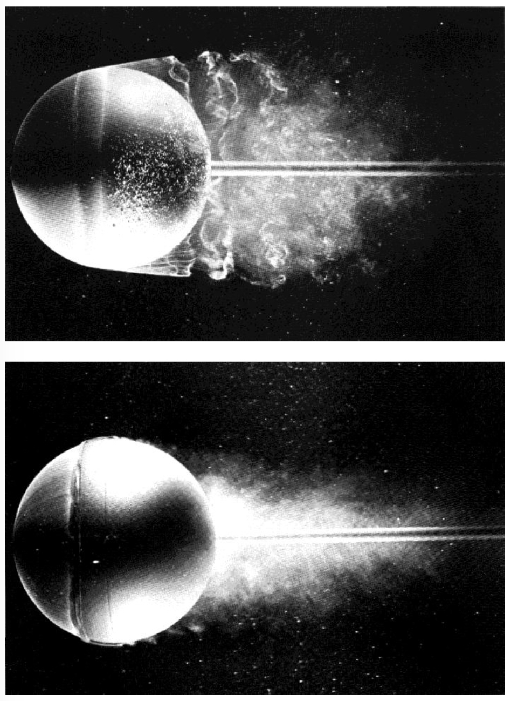
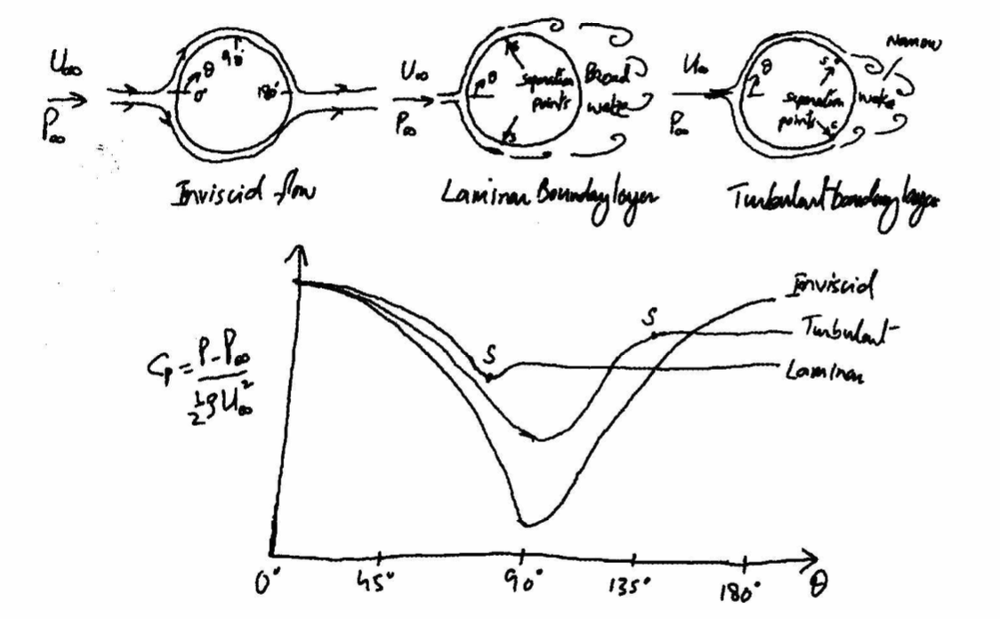
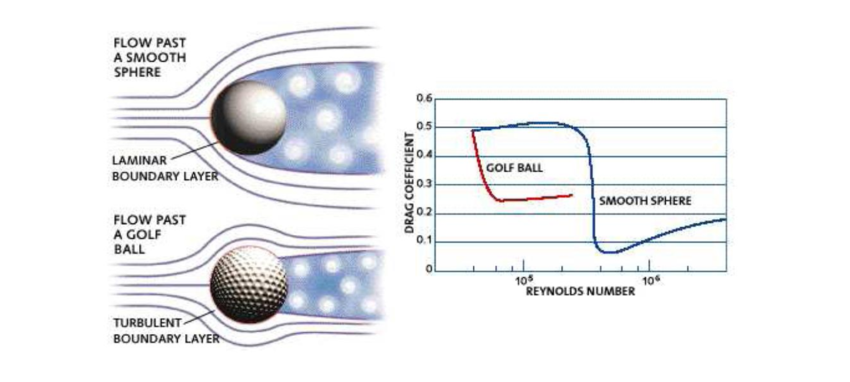
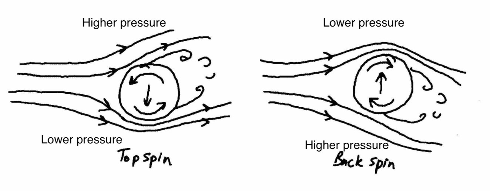
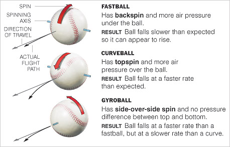
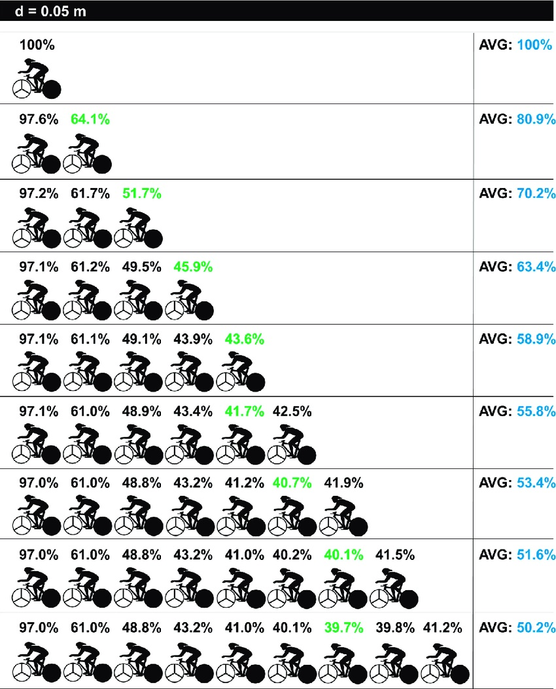
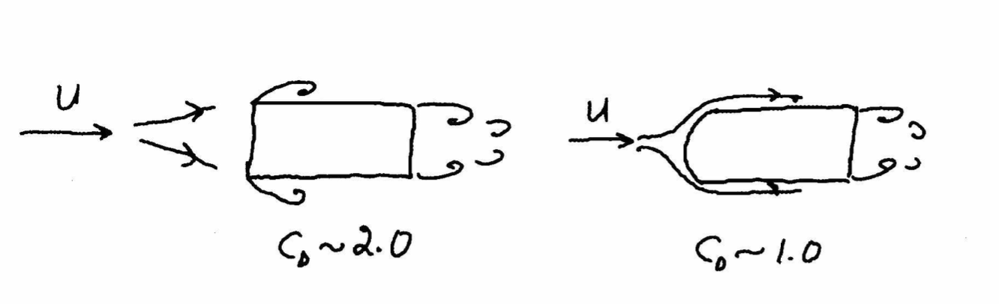
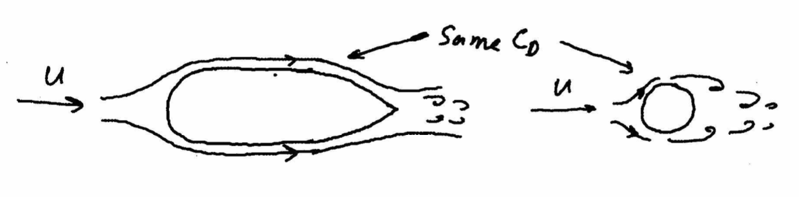
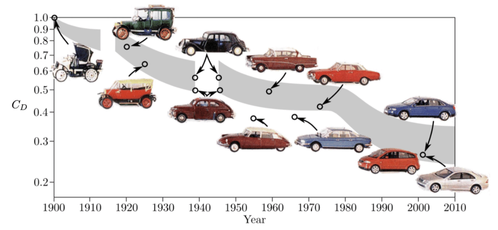

# MME 3303A: Fluid Mechanics II
## Unit 4: Flow Past Immersed Bodies
## Topic 3: Drag Force Applications
Instructor: C.T. DeGroot, PhD, PEng  

---
<!-- Section 01: Topic Learning Objectives-->
## Topic Learning Objectives

- Understand drag on spheres and the drag crisis phenomenon.
- Understand the fluid mechanics of sports balls.
- Be able to explain drafting and streamlining for drag reduction.

---
<!-- Section 02: Flow over a Sphere-->
## Flow Over a Sphere

- We have looked at two special flow cases in which the drag force was either friction drag or pressure drag.
- For the flow over a sphere, both $x$- and $y$- components of shear stress and pressure are present
    - Thus, both friction drag and pressure drag contribute to the total drag.
- For flow over a smooth sphere, the drag coefficient is a function of Reynolds number.
- For very low Reynolds numbers, $\text{Re} \leq 1$, where the viscous forces are dominant and inertia forces are negligible, the drag force is given by:

$$F_D = 3 \pi \mu V d$$

--
## Flow Over a Sphere

- The drag coefficient is then:

$$C_D = \frac{24}{\text{Re}}, \quad \text{for Re} \leq 1$$

- Both friction and pressure drag contribute to the total drag force.
- The wake behind the sphere is at relatively low pressure, leading to a large pressure drag, which becomes the main contributor to the total drag force.

--
## Flow Over a Sphere

- Influence of Reynolds number on the drag on a sphere:

--
<!-- .slide: class="instructor-only" -->
## Flow Over a Sphere

- On the previous figure:
    - 2: attached flow (Stokes flow) and steady separated flow
    - 3: separated unsteady flow, having a laminar boundary layer upstream of the separation, and producing a vortex street, 
    - 4: separated unsteady flow with a laminar boundary layer at upstream side, before flow separation, with downstream of the sphere a chaotic turbulent wake
    - 5: super-critical separated flow, with a turbulent boundary layer.

---
<!-- Section 03: Drag Crisis-->
## Drag Crisis

- As shown in the previous figure, for $10^3 < \text{Re} < 3 \times 10^5$, the drag coefficient of a sphere is approximately constant.
    - In this range the entire rear of the sphere has a low-pressure turbulent wake.
- For Reynolds number greater than $3 \times 10^5$, the boundary layer on the forward portion of the sphere becomes turbulent.
- A turbulent boundary layer has more momentum flux than a laminar boundary layer and therefore, can better resist an adverse pressure gradient.
    - In the presence of turbulent boundary layer, the point of separation moves downstream from the sphere mid-section and the size of the wake decreases.
    - As a result, the net pressure force on the sphere is reduced and the drag coefficient decreases abruptly.

--
## Laminar vs. Turbulent BL Over a Sphere

- In the turbulent case, a trip wire is used to cause early transition to turbulence.

--
<!-- .slide: class="student-only" -->
## Pressure Distribution on Sphere

--
<!-- .slide: class="instructor-only" -->
## Pressure Distribution on Sphere

> 
<!-- .element: class="annotation-space" -->

--
## Effects of Turbulence on Drag

- Turbulent boundary layer flow is desirable for flow past a blunt object because it delays separation and thus, reduces the pressure drag.
- The transition from laminar to turbulent boundary layer is affected by the roughness of the sphere surface and the turbulence in the flow stream.
- If the surface is rough or the turbulence is high in the free stream flow, the transition occurs at relatively low Reynolds number.
- Similar to the circular cylinder, a sphere also undergoes a transition to turbulence at the critical Reynolds number of about $5 \times 10^5$, which corresponds to a sudden dip of the drag coefficient similar to that observed above.

---
<!-- Section 04: Fluid Mechanics of Sports Balls-->
## Fluid Mechanics of Sports Balls

- The behavior of the separation point for the flow around a sphere at subcritical and supercritical Reynolds numbers is responsible for the bending of the flight paths of sports balls.
- In many sports such as tennis, cricket, soccer, baseball, golf, etc., the trajectory of a moving ball may bend in potentially unexpected ways.
- It has been found that the mechanics of trajectory bending is different for spinning and non-spinning balls.

--
## Golf Ball Dynamics

- The dimples on the golf ball make the surface rough, which leads to an early transition of laminar boundary layer into a turbulent boundary layer.
- As the boundary layer becomes turbulent, the separation point is moved further downstream resulting in the reduction of the wake size and hence the drag force.

--
<!-- .slide: class="student-only" -->
## Golf Ball Dynamics

--
<!-- .slide: class="instructor-only" -->
## Golf Ball Dynamics

> 
<!-- .element: class="annotation-space" -->

---
<!-- Section 05: Tennis Ball Dynamics-->
## Tennis Ball Dynamics

- The path of a tennis ball is able to bend because of spin.
- A ball hit with topspin curves downward, whereas a ball hit with underspin (backspin) travels along a much flatter trajectory than a ball hit without a spin.
- A general way to express this phenomenon is through the *Magnus effect*.
- The Magnus effect is based on Bernoulli theorem, i.e., the fluid pressure decreases at locations where the fluid velocity increases.
- The rough surface of the tennis ball lowers the critical Reynolds number, so that for a well-hit tennis ball, the boundary layers on both sides of the ball have already undergone transition.

--
<!-- .slide: class="student-only" -->
## Tennis Ball Dynamics

--
<!-- .slide: class="instructor-only" -->
## Tennis Ball Dynamics

> 
<!-- .element: class="annotation-space" -->

---
<!-- Section 06: Baseball Dynamics-->
## Baseball Dynamics

- A baseball pitcher uses different kinds of deliveries.
- The typical Reynolds number is around $2 \times 10^5$.
- The dynamics are similar to that of a spinning tennis ball.

--
<!-- .slide: class="student-only" -->
## Baseball Dynamics

- Flight paths for different pitches:

--
<!-- .slide: class="instructor-only" -->
## Baseball Dynamics

- Flight paths for different pitches:

> 
<!-- .element: class="annotation-space" -->

---
<!-- Section 07: Drafting-->
## Drafting

- All the experimentally obtained values for the drag we have discussed in this section are for single objects immersed in an unbounded fluid stream.
- In numerous realistic flow situations, interactions occur with nearby objects/surfaces.
- Drag can be reduced significantly when two or more objects, moving in tandem, interact.
- Drag could reduce up to 80% with the optimum spacing.
- Drag can be affected by neighbors alongside as well.

--
## Drafting

--
## Drafting

---
<!-- Section 08: Streamlining-->
<!-- .slide: class="student-only" -->
## Streamlining

- If we can reduce or eliminate the separated flow region behind the object, we can reduce the drag.
- The separated flow region can be reduced or eliminated by streamlining the body shape.

--
<!-- .slide: class="instructor-only" -->
## Streamlining

- If we can reduce or eliminate the separated flow region behind the object, we can reduce the drag.
- The separated flow region can be reduced or eliminated by streamlining the body shape.

> 
<!-- .element: class="annotation-space" -->

--
<!-- .slide: class="student-only" -->
## Streamlining

- If the shape of the object is convergent at the rear, the streamlines will converge too.
    - Flow area becomes larger, so velocity will decrease by continuity, and, thus, pressure will increase.
    - Increase in pressure at the rear of an object results in the reduction of the drag.
    - Therefore, we can reduce the drag on a body by making the rear of the body more tapered.

--
<!-- .slide: class="instructor-only" -->
## Streamlining

- If the shape of the object is convergent at the rear, the streamlines will converge too.
    - Flow area becomes larger, so velocity will decrease by continuity, and, thus, pressure will increase.
    - Increase in pressure at the rear of an object results in the reduction of the drag.
    - Therefore, we can reduce the drag on a body by making the rear of the body more tapered.

> 
<!-- .element: class="annotation-space" -->

--
## Streamlining

- Streamlining an object will reduce the adverse pressure gradient and make the wake smaller.
- However, by transforming a sphere into a "teardrop" shape, we increase the surface area which increases the skin friction drag.
- In many cases, with the proper tapering, the drag coefficient can be reduced by 80%, as compared to the circular cylinder of the same thickness.

--
## Streamlining

- Tapering is done on many structural members of an aircraft to reduce what we call the *aerodynamic drag*, which is the drag experienced by a body moving in air.
    - This significantly improves the fuel efficiency.
- Reduction of aerodynamic drag is also important for road vehicle applications.
    - Due to practical limits on the overall length of road vehicles, fully streamlined tails are impractical.
    - Therefore, it is not possible to achieve results that are comparable to those for optimum airfoil shapes. 
    - It is possible to optimize both front and rear contours within the limited overall length of the vehicle.

--
## Automobile Drag Reduction

