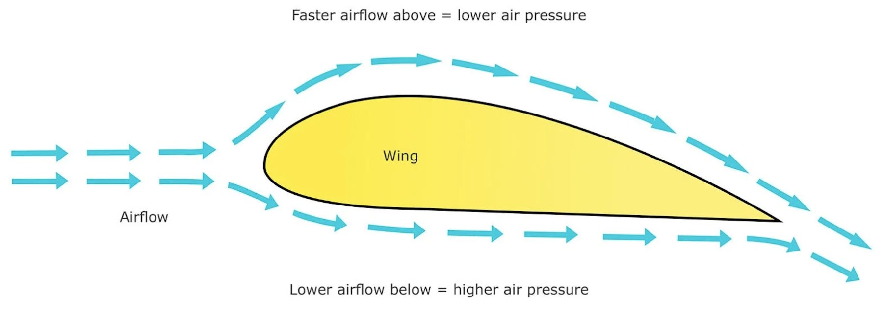
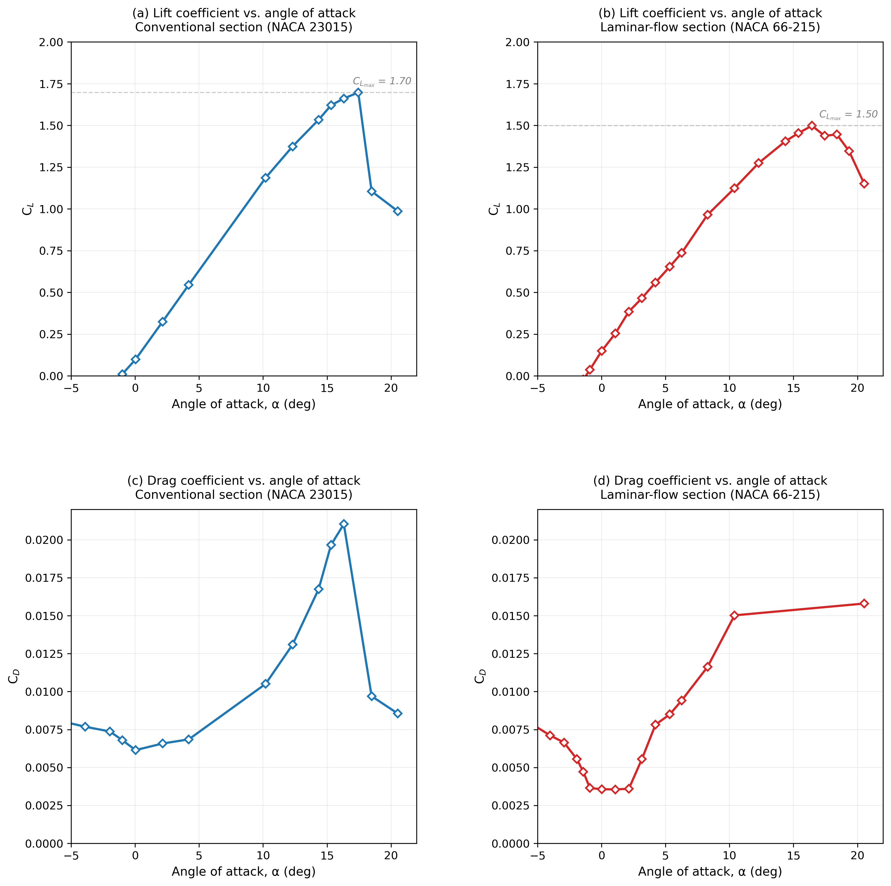
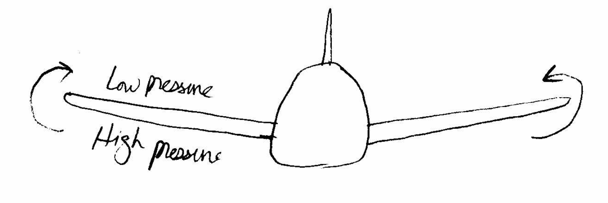
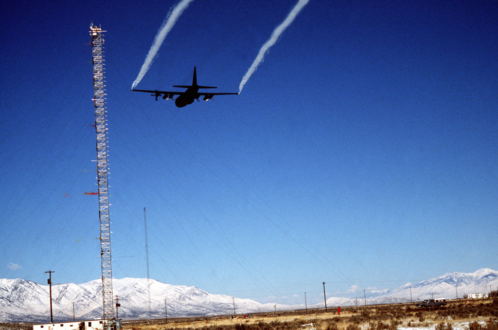
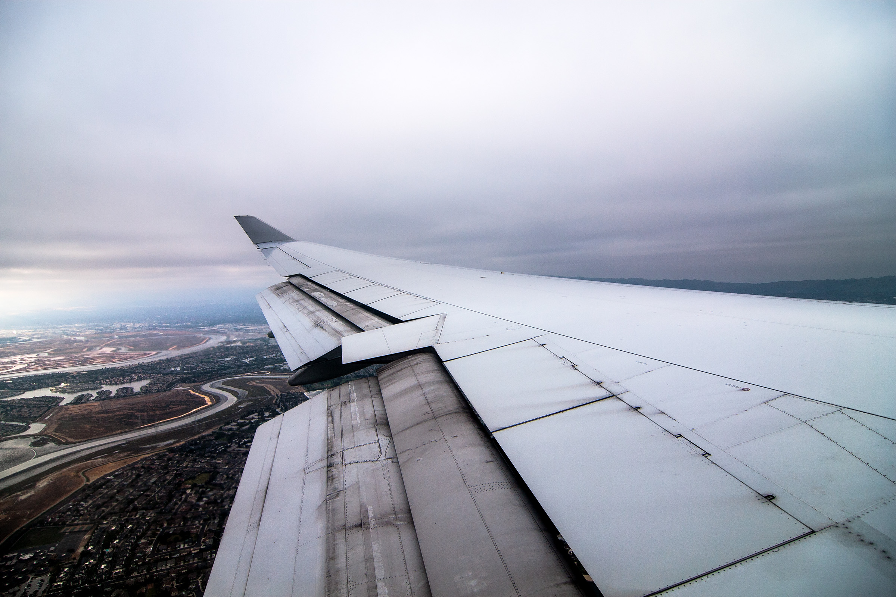
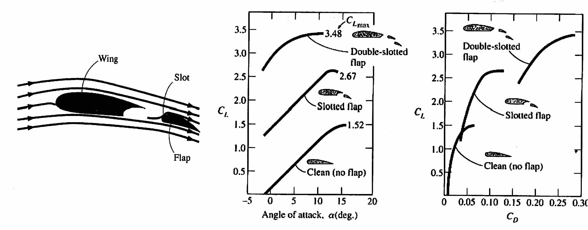

# MME 3303A: Fluid Mechanics II
## Unit 4: Flow Past Immersed Bodies
## Topic 4: Lift Force
Instructor: C.T. DeGroot, PhD, PEng  

---
<!-- Section 01: Topic Learning Objectives-->
## Topic Learning Objectives

- Understand the concept of lift force and lift coefficient.
- Understand the influence of angle of attack on lift and drag.
- Be able to explain wing-tip vortices and induced drag.
- Understand variable-geometry wing sections and flaps.

---
<!-- Section 02: Lift Force and Lift Coefficient-->
## Lift Force

- *Lift* is the component of force acting perpendicular to the direction of fluid motion.
- If an object is symmetric and it produces a symmetrical flow field, the only force will be the drag force.
    - However, if the object is not symmetric or if it does not produce a symmetrical flow field (e.g., a rotating sphere) then a lift force is exerted by the fluid on the object.
- Regarding the drag force, in general, we are interested in reducing this force; however, for the lift force, it is not always desirable to decrease it.
    - For example, airfoils are designed to generate lift, whereas, in automobiles, it desirable to reduce the lift (why?).

--
## Lift Coefficient

- $C_L$ is the lift coefficient, defined as:

$$C_L = \frac{F_L}{\frac{1}{2}\rho V^2 A_p}$$

- where:
    - $F_L$ is the lift force.
    - $A_p$ is the planform area.

---
<!-- Section 03: Airfoils -->
<!-- .slide: class="student-only" -->
## Airfoil Terminology

- Consider an airfoil:

--
<!-- .slide: class="instructor-only" -->
## Airfoil Terminology

- Consider an airfoil:

> 
<!-- .element: class="annotation-space" -->

--
## Airfoil Terminology

- The *chord* of an airfoil is the straight line joining the leading edge and the trailing edge.
- The *angle of attack*, $\alpha$, is the angle between the airfoil chord and the free stream velocity.
- The *planform area* is the projected area of the airfoil that is used to define lift for an airfoil.
- If the chord line is not a line of symmetry then the airfoil is said to be *cambered*.
- The Reynolds number in airfoil design is based on the chord length and is referred to as the *chord Reynolds number*.

---
<!-- Section 04: Lift Generation -->
## Lift Generation Mechanisms

- Most common lift-generating devices such as, airfoils, fans, etc., operate in the large Reynolds number range in which the viscous effects are confined to the boundary layers and the wake regions.
- For such cases, the wall shear stress contributes little to the lift, and most of the lift comes from the surface pressure distribution.
- For objects operating in very low Reynolds number regime (i.e. $\text{Re} < 1$), viscous effects are important, and the contribution of the shear stress to the lift may be as important as that of the pressure (e.g., the flight of small insects).

--
## Lift Generation for Airfoils

- The phenomenon of aerodynamic lift is commonly explained as the generation of different pressure distributions on the top and bottom surfaces.
- It is supposed that the velocity over the top surface is faster than the velocity over the bottom surface.
    - This causes lower pressure on the top of the airfoil and higher pressure on the bottom of the airfoil (the Bernoulli Effect).
- This pressure difference causes the lift force.

--
<!-- .slide: class="student-only" -->
## Lift Generation for Airfoils

--
<!-- .slide: class="instructor-only" -->
## Lift Generation for Airfoils

> 
<!-- .element: class="annotation-space" -->

--
## Limitations of the Bernoulli Explanation

- The Bernoulli-based explanation (faster flow on top $\rightarrow$ lower pressure $\rightarrow$ lift) is a useful simplification, but incomplete.
- This explanation raises the question: *Why does the flow move faster over the top surface?*
- The common answer "the flow must travel farther over the curved top surface" (equal transit time theory) is actually incorrect, since the upper and lower surface flows do not have to take the same time to meet at the trailing edge.

--
## A More Complete Picture of Lift

- **Flow deflection (Newton's laws):** The wing deflects air downward, creating a downward momentum change. By Newton's third law, this produces an upward force (lift) on the wing.
- **Circulation theory:** The wing establishes a circulation pattern around itself. This circulation, combined with the freestream velocity, creates the pressure distribution that results in lift (this relationship is described by the Kutta-Joukowski theorem).
- **Pressure distribution:** The asymmetric shape and angle of attack create a pressure field where the upper surface has lower pressure and the lower surface has higher pressure; this is the *result* of the flow pattern, not the fundamental cause.

--
## Practical Takeaway

- Both perspectives (Newton's deflection and Bernoulli's pressure) describe the same physical phenomenon from different viewpoints and are both valid.
- The simplified Bernoulli explanation helps build intuition, but rigorous airfoil design requires consideration of the complete flow field, including:
    - Boundary layer development.
    - Flow separation and stall.
    - Viscous effects.
    - Three-dimensional flow effects (wingtip vortices, induced drag, etc.).

---
<!-- Section 05: Influence of Angle of Attack-->
## Influence of the Angle of Attack

- At low angle of attack, the rear surfaces have an adverse pressure gradient but not enough to cause significant boundary layer separation.
    - The flow is smooth, drag is small, and lift is positive.
- As the angle of attack increases, the adverse pressure gradient on the upper surface becomes stronger and the separation point moves forward from the rear of the airfoil.
- If the angle of attack becomes too large, typically between 15$^\circ$ and 20$^\circ$, the flow is separated completely from the upper surface and the airfoil is said to be *stalled*.
    - In this case, the lift drops significantly, the drag increases significantly, and the airfoil can no longer fly.

--
## Airfoil Comparison: Conventional vs Laminar Flow

- To better understand airfoil performance, we compare two NACA airfoil designs:
    - **NACA 23015:** A conventional airfoil design from the 1930s.
    - **NACA 66-215:** A laminar flow airfoil developed in the 1940s.
- Both airfoils have similar thickness ratios (15% for both) but differ significantly in their aerodynamic characteristics.
- The data comes from NACA Report 824 (1945) wind tunnel tests at Reynolds number Re = 6 $\times$ 10$^6$ (based on chord length).

--
## What is a Laminar Flow Airfoil?

- A **laminar flow airfoil** is designed to maintain laminar boundary layer flow over a larger portion of its surface compared to conventional airfoils.
- Key design features:
    - Maximum thickness positioned farther aft (typically 40-50% of chord vs. 30% for conventional).
    - Smoother pressure distribution to delay transition to turbulent flow.
    - More gradual contour changes to avoid flow separation.
- The laminar boundary layer has much lower skin friction than a turbulent boundary layer, resulting in significantly reduced drag.

--
## Lift and Drag vs Angle of Attack

--
## Performance Comparison Results

- **NACA 23015 (Conventional Airfoil):**
    - Maximum lift coefficient: $C_{L,max} = 1.697$.
    - Minimum drag coefficient: $C_{D,min} = 0.00614$.
    - Stall occurs around $\alpha \approx 16$^\circ$.

- **NACA 66-215 (Laminar Flow Airfoil):**
    - Maximum lift coefficient: $C_{L,max} = 1.498$ (12% lower).
    - Minimum drag coefficient: $C_{D,min} = 0.00356$ (42% lower!).
    - More gradual stall characteristics.

--
## Why the Performance Difference?

- **Conventional Airfoil (NACA 23015):**
    - Transition to turbulent flow occurs early (around 10-15% chord).
    - Most of the surface has turbulent boundary layer.
    - Higher skin friction drag throughout.

- **Laminar Flow Airfoil (NACA 66-215):**
    - Maintains laminar flow up to 60-70% of chord under ideal conditions, then transitions to turbulence.
    - Significantly lower skin friction over most of the surface.
    - Design is more sensitive to surface roughness and manufacturing quality.

--
## Airfoil Design Considerations

- The lift/drag ratio, $C_L/C_D$ is very important in the design of an aircraft.
- The lift coefficient determines the lift of the wing and hence the load that can be carried.
- The drag coefficient determines a large part of the drag that the airplane engines have to work against to generate the needed lift. 
- A high $C_L/C_D$ ratio is the design goal.
- Recent advancements in modeling and computational capabilities have made it possible to design airfoil sections that develop high lift while maintaining very low drag.

--
## Upwash and Downwash

- When a wing generates lift, it doesn't just affect the air directly at the wing - it also influences the air ahead of and behind the wing.
- **Upwash:** Air ahead of the wing is deflected upward before reaching the leading edge.
- **Downwash:** Air behind the wing is deflected downward as it leaves the trailing edge.
- These effects are caused by the pressure difference between the upper and lower wing surfaces.

--
<!-- .slide: class="student-only" -->
## Upwash and Downwash Effects

--
<!-- .slide: class="instructor-only" -->
## Upwash and Downwash Effects

> 
<!-- .element: class="annotation-space" -->

--
## Effect on Effective Angle of Attack

- The wing "sees" the average flow direction between the upwash (ahead) and downwash (behind).
- This means the **effective angle of attack** experienced by the wing is **smaller** than the geometric angle of attack.
- The reduction in effective angle of attack is called the **induced angle of attack**, $\alpha_i$.
- Result: The wing produces less lift than expected and experiences **induced drag**.

$$\alpha_{\text{effective}} = \alpha_{\text{geometric}} - \alpha_i$$

---
<!-- Section 06: Wing-Tip Vortices-->
## Wing-Tip Vortices

- The $C_L$ and $C_D$ data presented above considered infinitely long span (i.e., a two-dimensional flow pattern around wings without tips). 
- For finite span wings (real applications), the tip effects reduce $C_L$ and increase $C_D$.
- If we consider the pressure distribution near the end of the wing, the low pressure on the upper and high pressure on the lower surface cause flow to occur around the wing tip, leading to wing-tip vortices. 
    - As a result, the pressure difference is reduced, leading to less lift.

--
<!-- .slide: class="student-only" -->
## Wing-Tip Vortices

--
<!-- .slide: class="instructor-only" -->
## Wing-Tip Vortices

> 
<!-- .element: class="annotation-space" -->

--
## Wing-Tip Vortices

- These trailing vortices can be very strong and persistent, and possibly become a hazard to other aircraft for 5 to 10 miles behind a large airplane.

--
## Wing-Tip Vortices

--
## Wing Design Considerations

- **Chord Length**
    - A wing with a longer chord will deflect the airflow down more than a shorter wing, creating more up wash ahead of the wing. 
    - Thus, a shorter chord length is desirable.
- **Wing Span**
    - A short span causes more of the wing to be affected by the trailing or tip vortex, since the size of the vortex will become larger as compared to the wing span.
    - Thus, a wing with large span reduces the influence of the tip vortex.
- Therefore, induced drag will be lower on an aircraft with short chord length and long wingspan. 

--
## Wing Design Considerations

- Variations in wingaspect ratio are also seen in nature. 
    - Soaring birds have wings of long span.
    - Birds that must maneuver quickly to catch their prey have wings of relatively short span, which gives low wing loading and thus, high maneuverability.

--
## Winglets

- Winglets are short, aerodynamically contoured wings set perpendicular to the wing at the tip.
- They are one of the most effective means to reduce induced drag due to wingtip vortices.

---
<!-- Section 07: Induced Drag-->
## Induced Drag

- **Induced drag** is the drag that occurs as a direct consequence of producing lift.
- It is called "induced" because it is *induced* by the generation of lift - you cannot have induced drag without lift.
- This is fundamentally different from:
    - **Pressure drag** (form drag due to shape)
    - **Skin friction drag** (due to viscosity)

--
## Why Does Lift Create Drag?

- In an ideal 2D world with infinite wingspan, lift would be perpendicular to the flow direction.
- However, real 3D wings with finite span create wingtip vortices due to pressure differences between upper and lower surfaces.
- These vortices cause upwash ahead of the wing and downwash behind the wing.

--
<!-- .slide: class="student-only" -->
## Induced Drag Mechanism

--
<!-- .slide: class="instructor-only" -->
## Induced Drag Mechanism

> 
<!-- .element: class="annotation-space" -->

--
## How Upwash/Downwash Creates Induced Drag

- The wing experiences flow at an angle between the upwash (ahead) and downwash (behind).
- This reduces the **effective angle of attack**: $\alpha_{\text{eff}} = \alpha - \alpha_i$
- The resulting lift force is tilted backward (not perfectly perpendicular to freestream).

--
## Key Insights About Induced Drag

- Induced drag is **proportional to lift squared**: $C_{D,i} \propto C_L^2$
    - High lift (takeoff/landing) $\rightarrow$ high induced drag
    - Low lift (cruise) $\rightarrow$ low induced drag
- Induced drag **decreases with aspect ratio**:
    - Long, narrow wings (gliders) $\rightarrow$ low induced drag
    - Short, wide wings $\rightarrow$ high induced drag
- Induced drag is most significant at **low speeds** (when high $C_L$ is needed)

---
<!-- Section 08: Stall and Low Speed Flight-->
## Stall Speed

- In steady-state flight conditions, the lift must be equal to the aircraft weight, that is,

$$W = F_L = C_L \frac{1}{2} \rho V^2 A$$

- The maximum lift coefficient, $C_{L,max}$, is low for the thin airfoils.
- Since the cruising speed is very high, the required lift force is maintained.

--
<!-- .slide: class="student-only" -->
## Stall Speed

- The minimum flight speed or stall speed is obtained when $C_L = C_{L,max}$. Thus, the minimum flight speed can be obtained by solving the above equation for $V_{min}$. That is:

--
<!-- .slide: class="instructor-only" -->
## Stall Speed

- The minimum flight speed or stall speed is obtained when $C_L = C_{L,max}$. Thus, the minimum flight speed can be obtained by solving the above equation for $V_{min}$. That is:

>- $V_{\min} = \left(\frac{2W}{\rho C_{L,max} A}\right)^{1/2}$
<!-- .element: class="annotation-space" -->

--
## Low-Speed Flight

- During takeoff and landing, the speed of the aircraft is very low.
- With the same lift coefficient, the required lift force cannot be achieved.
- The above equation shows that if we want to maintain the same lift at low flight velocity, either $C_{L,max}$ or the wing area has to increase.

---
<!-- Section 09: Variable-Geometry Wing Sections-->
## Variable-Geometry Wing Sections Technique

- Aircraft wings must operate in several different modes.
    - During takeoff maximum lift is required.
    - During cruise, minimum drag is required while ensuring lift is high enough to keep the aircraft at a constant altitude.
    - During landing, larger drag is required to slow down the aircraft and the lift force should be reduced to bring the aircraft to the ground.
- No single wing or airfoil shape can be optimized for all the operational modes.
- A solution to this problem lies in making the wing adjustable.

--
## Flaps

- Flaps on both the leading and trailing edges change the airfoil shape, i.e., they alter the amount of camber.
- Flaps are movable portions of a wing trailing edge that may be extended during landing and takeoff to increase the effective wing area.
- Use of flap considerably enhances the lift coefficient, but at the same time it also increases the drag significantly.
- This increase in drag is not of much concern during landing and takeoff operations, since the reduced speed in landing and takeoff is more important.

--
## Flap Configurations

--
## 747 Flap Deployment

---
<!-- Section 10: Example-->
<!-- .slide: style="font-size: 0.8em;" -->
## Example

A commercial airplane has a total mass of 70,000 kg and a wing planform area of 150 m². The plane has a cruising speed of 558 km/hr and a cruising altitude of 12000m, where the density of air is 0.312 kg/m³. The plane has double-slotted flaps for use during takeoff and landing, but it cruises with all flaps retracted. Assuming that the lift and drag characteristics of the wing can be approximated by NACA23012 airfoil. Determine,

- (i) The angle of attack to cruise steadily at the cruising altitude
- (ii) The power required to provide enough thrust to fly at the cruising speed
- (iii) If the double-slotted flap is used during the takeoff, determine how much less velocity is needed compared to using no flap configuration? Assuming that the planform area and the double slotted flap are increased by 15% when flaps are deployed.

Assuming that the contributions to lift and drag by parts of the airplane other than the wing (e.g. fuselage) are negligible and the tip effects are ignored. The density of air at ground can be assumed as 1.2 kg/m³.

--
## Example - Figure

--
<!-- .slide: class="student-only" -->
## Example

--
<!-- .slide: class="instructor-only" -->
## Example

>- **(i)** When an aircraft is cruising steadily at a constant altitude, the lift must be equal to the weight of the aircraft
>- i.e. $F_L = W$
>- $W = mg = 70,000 \times 9.81 = 686,700 \text{ N}$
>- Cruising velocity $= V = 558$ km/hr $\times \frac{1000}{3600} = 155$ m/s
>- $F_L = \frac{1}{2}C_L \rho V^2 A = W \Rightarrow C_L = \frac{2W}{\rho V^2 A} = \frac{(2)(686700)}{(0.312)(155)^2(150)}$
>- $\boxed{C_L = 1.22}$
>- During cruising, the flaps are retracted, thus from figure, for an airfoil with no flap, $C_L = 1.22$ corresponds to the angle of attack of $\boxed{\alpha \approx 10°}$
<!-- .element: class="annotation-space" -->

--
<!-- .slide: class="student-only" -->
## Example

--
<!-- .slide: class="instructor-only" -->
## Example

>- **(ii)** When an aircraft is cruising, the weight of the aircraft is balanced by the lift force, thus, the thrust to be provided by the engines must overcome the drag force. As given, the drag force due to other components is ignored and hence the drag force only due to the wings is considered.
>- $F_D = \frac{1}{2}C_D \rho V^2 A$
>- From figure, for an airfoil with no flaps, at $C_L = 1.22$, $C_D \approx 0.03$
>- Then, $F_D = \frac{1}{2}(0.03)(0.312)(155)^2(150) = 16900 \text{ N}$
>- $P_{min} = \text{Force} \times \text{velocity} = 16900 \times 155 = 2619500 \text{ W}$
>- $\boxed{P_{min} \approx 2.62 \text{ MW}}$
<!-- .element: class="annotation-space" -->

--
<!-- .slide: class="student-only" -->
## Example

--
<!-- .slide: class="instructor-only" -->
## Example

>- **(iii)** Considering the same aircraft and other dimensions except the wing shape i.e. assuming same angle of attack as well.
>- $F_{L,no\,flap} = F_{L,flap}$
>- $\frac{1}{2}C_{L,NF} \rho V_{NF}^2 A_{NF} = \frac{1}{2}C_{L,F} \rho V_F^2 A_F$
>- $A_F = 1.15 A_{NF} = (1.15)(150) = 172.5$ m$^2$
>- $\frac{V_{flap}}{V_{no\,flap}} = \left(\frac{C_{L,no\,flap}}{C_{L,flap}} \frac{A_{no\,flap}}{A_{flap}}\right)^{1/2}$
>- Considering the same angle of attack as above,
>- From figure at $\alpha = 10°$, $C_{L,no\,flap} \approx 1.22$, $C_{L,double\,slotted} \approx 3.48$
>- $\frac{V_{flap}}{V_{no\,flap}} = \left(\frac{(1.22)(150)}{(3.48)(172.5)}\right)^{1/2} = 0.55 \Rightarrow \boxed{V_{flap} = 0.55 \, V_{no\,flap}}$
<!-- .element: class="annotation-space" -->

---
<!-- Section 11: iClicker Problem-->
<!-- .slide: class="instructor-only" -->
## iClicker Question

During takeoff, an aircraft extends its flaps fully. What is the primary aerodynamic effect?

- A. Flaps decrease both lift and drag
- B. Flaps increase lift but have negligible effect on drag
- C. Flaps significantly increase both lift and drag
- D. Flaps decrease lift but increase drag for better control

--
<!-- .slide: class="instructor-only" -->
## iClicker Problem - Answer

**Answer: C**

*Explanation:* Flaps significantly increase both the lift coefficient and drag coefficient. During takeoff, the increased lift is beneficial as it allows the aircraft to become airborne at lower speeds. The increased drag is acceptable during takeoff (and landing) because the priority is achieving sufficient lift at lower velocities rather than minimizing drag. Once airborne and cruising, the flaps retract to reduce drag and achieve efficient flight with a smaller lift coefficient at higher speeds.