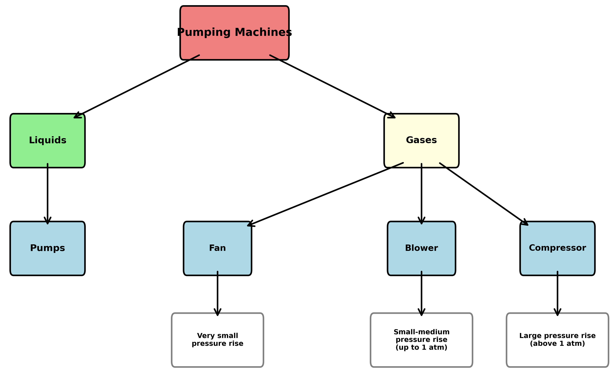
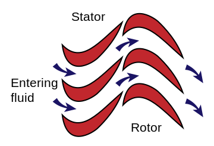
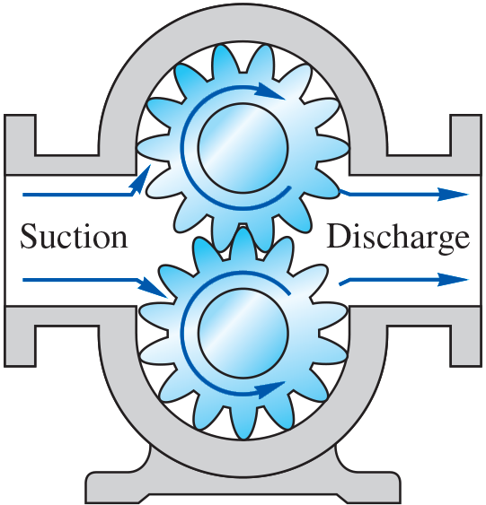
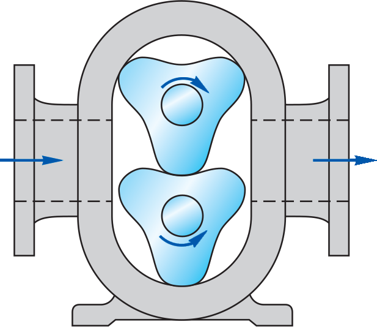
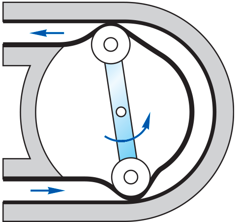
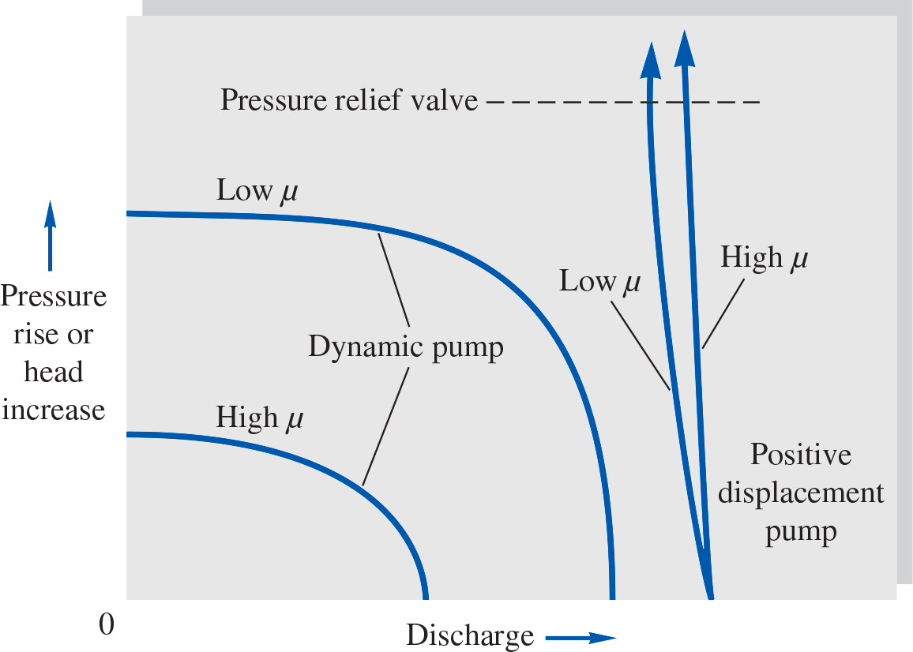
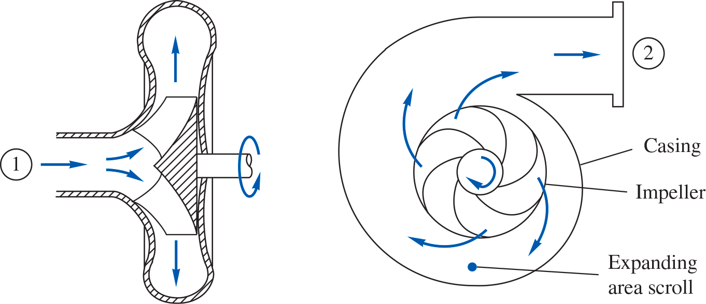
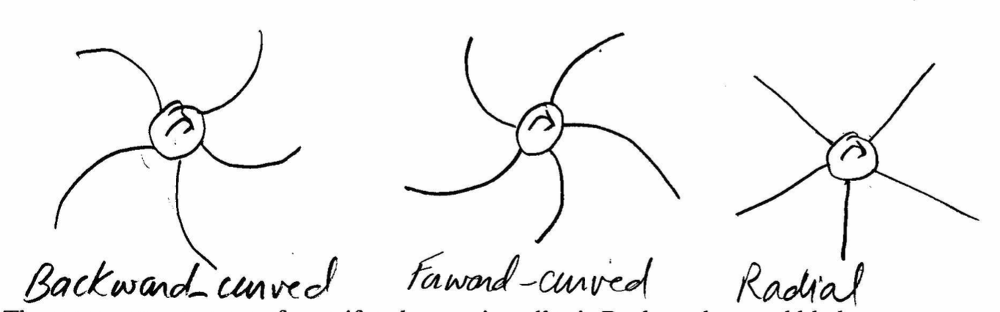
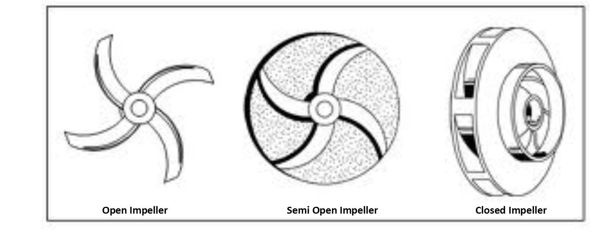
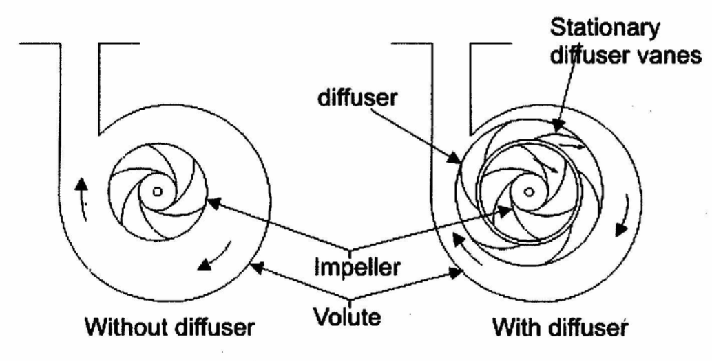

# MME 3303A: Fluid Mechanics II
## Unit 5: Turbomachinery
## Topic 1: Introduction to Turbomachinery and Pumps
Instructor: C.T. DeGroot, PhD, PEng  

---
<!-- Section 01: Topic Learning Objectives-->
## Topic Learning Objectives

- Understand the classification of turbomachinery.
- Understand the difference between positive displacement and dynamic pumps.
- Be able to analyze centrifugal pump performance using energy equations.

---
<!-- Section 02: Introduction to Turbomachinery-->
## Turbomachinery

- The most common practical engineering applications for fluid mechanics are the design of fluid machinery.
- Most of these fluid machines are connected to a rotating shaft and hence called *turbomachinery*.
- The prefix *turbo* is a Latin word meaning *spin* or *whirl*, appropriate for rotating devices.
- The turbomachines are broadly classified into two groups:
    - Machines that add energy to the fluid (pumping machines).
    - Machines that extract energy from the fluid (turbines).

--
## Turbomachinery Definitions

- **Pumping Machines:** Exert a shaft torque typically with an electric motor, and by using blades, flow channels or passages, force the fluid to move (i.e., work done on the fluid).
- **Turbines:** A fluid that is moving exerts force on the blades attached to a shaft causing the shaft to rotate.
- Many turbomachines contain some type of housing or casing that surrounds the rotating blades or rotor, thus forming an internal flow passageway through which the fluid flows.
- Some turbomachines are un-ducted, e.g., wind turbines or windmill.

--
<!-- .slide: class="student-only" -->
## Classification of Turbomachinery

--
<!-- .slide: class="instructor-only" -->
## Classification of Turbomachinery

> 
<!-- .element: class="annotation-space" -->

--
## Turbomachinery Components

- Some turbomachines include stationary blades (stators) or vanes in addition to the rotor blades.
- These stationary vanes can be arranged to accelerate the flow (acting as nozzles) or decelerate the flow (acting as diffuser).
- Many turbomachines contain some type of housing or casing that surrounds the rotating blades or rotor, thus forming an internal flow passageway through which the fluid flows.

--
<!-- .slide: class="student-only" -->
## Turbomachinery Components

--
<!-- .slide: class="instructor-only" -->
## Turbomachinery Components

> 
<!-- .element: class="annotation-space" -->

---
<!-- Section 03: Pump Classification-->
## Pumps

- Classification: There are two basic types of pumps:
    - Positive displacement pumps.
    - Dynamic or momentum change pumps.

--
## Positive Displacement Pumps

- These pumps force the fluid along by volume change.
- A cavity opens and the fluid is admitted through an inlet.
- The cavity then closes and the fluid is squeezed through an outlet.
- Examples: Human heart, hand pump.

--
## Positive Displacement Pump Characteristics

- All positive displacement pumps deliver a pulsating or periodic flow.
- Their big advantage is they can deliver fluid regardless of its viscosity.
- The reason why they are called positive displacement is that it is rare that such devices could run backward.
- Since positive displacement pumps compress mechanically against a cavity filled with liquid, they develop high pressure if the outlet is shut down for any reason.
    - Therefore, these pumps have strong construction and equipped with pressure relief valves.

--
## Reciprocating Piston/Plunger

--
## Lobe Pump

--
## Flexible Tube Peristaltic Pump

--
## Dynamic Pumps

- Dynamic pumps add momentum to the fluid by means of fast-moving blades, vanes, or certain special designs.
- There is no closed volume; the fluid increases momentum while moving through open passages and then converts its high velocity to a pressure increase by exiting into a diffuser section.
- The most common type of dynamic pumps are rotary pumps which are classified as:
    - Centrifugal or radial exit flow.
    - Axial flow.
    - Mixed flow (between radial and axial).

--
<!-- .slide: style="font-size: 0.8em;" -->
## Comparison: Dynamic vs Positive Displacement Pumps

| Dynamic Pumps | Positive Displacement Pumps |
|---------------|----------------------------|
| High flow rates (up to 30,000 gpm / 1900 L/s) | Low flow rates (up to 100 gpm / 6 L/s) |
| Moderate pressure rise (few atmospheres) | High pressure rise (up to 300 atmospheres) |
| Generally needs priming (i.e., cannot suck up a liquid from below if they are filled with gas) | Self-priming |
| Performance varies with flow rate. Low flow rate → high pressure (or head) rise. High flow rate → low pressure (or head) rise | Flow rate cannot be varied except by changing the displacement or speed. Therefore, widely used for flow metering |

--
## Pump Performance Curves

---
<!-- Section 04: Centrifugal Pumps-->
## Centrifugal Pump

- A centrifugal pump consists of an impeller rotating within a casing.
- Fluid enters axially through the eye of the casing.
- Due to its interaction with the rotating impeller blades, it is whirled tangentially and radially outward until it leaves through all circumferential parts of the impeller into the diffuser part of the casing.
- The fluid gains both velocity and pressure while passing through the impeller. That is, energy is added to the flow (work done by the blade on the fluid).
- The doughnut-shaped diffuser or scroll section of the casing decelerates the flow and further increases the pressure.

--
## Centrifugal Pump

--
<!-- .slide: class="student-only" -->
## Impeller Blade Types

- The impeller blades could be of the following shapes:
    - Backward-curved (most common)
    - Forward-curved
    - Radial

--
<!-- .slide: class="instructor-only" -->
## Impeller Blade Types

- The impeller blades could be of the following shapes:
    - Backward-curved (most common)
    - Forward-curved
    - Radial

> 
<!-- .element: class="annotation-space" -->

--
## Open vs Closed Impellers

- Blades may be open (separated from the front casing only by a narrow spacing), or closed (shrouded from the casing on both sides by an impeller wall).

--
## Diffuser Types

- The diffuser may have **vanes** to help guide the flow towards exit or be **vaneless**.

---
<!-- Section 05: Energy Analysis-->
<!-- .slide: class="student-only" -->
## Basic Output Parameters

- Recall the energy equation for steady, incompressible flow with one inlet and one outlet:

--
<!-- .slide: class="instructor-only" -->
## Basic Output Parameters

- Recall the energy equation for steady, incompressible flow with one inlet and one outlet:

>- $H = \left(\frac{p}{\rho g} + \frac{V^2}{2g} + z \right)_\mathrm{out} -\left(\frac{p}{\rho g} + \frac{V^2}{2g} + z \right)_\mathrm{in} = h_s - h_f $
>- where: $h_{\text{s}}$ is the pump head supplied, $h_{\text{f}}$ is the losses, and $H$ is the net head.
>- Usually $z_{\text{in}} \approx z_{\text{out}}$ and $V_{\text{in}} \approx V_{\text{out}}$.
>- Head loss in the pump is small compared to the head gain, so this can be ignored inside the pump, as a simplifying assumption.
>- $ h_s \approx \frac{p_\mathrm{out} -p_\mathrm{in}}{\rho g} = \frac{\Delta p}{\rho g}$
<!-- .element: class="annotation-space" -->

--
<!-- .slide: class="student-only" -->
## Basic Output Parameters

- Now recall the original form of energy equation for steady state with one inlet and one outlet:

--
<!-- .slide: class="instructor-only" -->
## Basic Output Parameters

- Now recall the original form of energy equation for steady state with one inlet and one outlet:

>- $\dot{W}_\mathrm{in} - \dot{Q}_\mathrm{out} = \dot{m}\left[(h_\mathrm{out} + \frac{V_\mathrm{out}^2}{2} + gz_\mathrm{out}) - (h_\mathrm{in} + \frac{V_\mathrm{in}^2}{2} + gz_\mathrm{in})\right] $
>- Assume adiabatic, $V_{in}\approx V_{out}$, $z_{in}\approx z_{out}$
>- $\dot{W}_\mathrm{in} = \dot{m}\left( h_\mathrm{out} - h_\mathrm{in} \right)$
>- But, remember that $h = u + pv = u + \frac{p}{\rho}$
>- $\dot{W}_\mathrm{in} = \dot{m}\left( u_\mathrm{out} + \frac{p_\mathrm{out}}{\rho} - u_\mathrm{in} - \frac{p_\mathrm{in}}{\rho} \right) = = \dot{m}\left( u_\mathrm{out} - u_\mathrm{in} + \frac{p_\mathrm{out} - p_\mathrm{in}}{\rho}\right)$
>- In pumps, thermal energy change is minimal, so $u_\mathrm{out} \approx u_\mathrm{in}$
<!-- .element: class="annotation-space" -->

--
<!-- .slide: class="student-only" -->
## Basic Output Parameters

--
<!-- .slide: class="instructor-only" -->
## Basic Output Parameters

>- Therefore, $\dot{W}_\mathrm{in} = \dot{m}\frac{\Delta p}{\rho}$
>- But, $\dot{m} = \rho \dot{V}$, so $\dot{W}_\mathrm{in} = \dot{V}\Delta p$
>- From before, $H = h_s = \frac{\Delta p}{\rho g} \rightarrow \Delta p = \rho g H$
>- Therefore, $\dot{W}_\mathrm{in} = \rho g \dot{V} H$
<!-- .element: class="annotation-space" -->

--
<!-- .slide: class="student-only" -->
## Pump Efficiency

- Pump efficiency is defined as:

--
<!-- .slide: class="instructor-only" -->
## Pump Efficiency

- Pump efficiency is defined as:

>- $\eta_{\text{pump}} = \frac{\dot{W}_{\text{pump}}}{\text{bhp}}$
>- $\text{bhp}$ = brake horse power = power required to drive the pump
>- $\text{bhp} = \omega T$, where $\omega$ is shaft angular velocity and $T$ is shaft torque
>- Note conversion: 1 hp = 550 ft$\cdot$lbf/s = 746 W
>- $\eta_{\text{pump}} = \frac{\rho g \dot{V} H}{\omega T}$
>- The main objective of a pump designer is to make $\eta$ as high as possible over a broad range of volume flow rates.
<!-- .element: class="annotation-space" -->

---
<!-- Section 6: iClicker Problem-->
<!-- .slide: class="instructor-only" -->
## iClicker Question

Which statement is TRUE about dynamic pumps compared to positive displacement pumps?

- A. Dynamic pumps deliver higher pressures
- B. Dynamic pumps deliver higher flow rates
- C. Dynamic pumps are self-priming
- D. Dynamic pumps deliver constant flow regardless of pressure

--
<!-- .slide: class="instructor-only" -->
## iClicker Question - Answer

**Answer: B**
