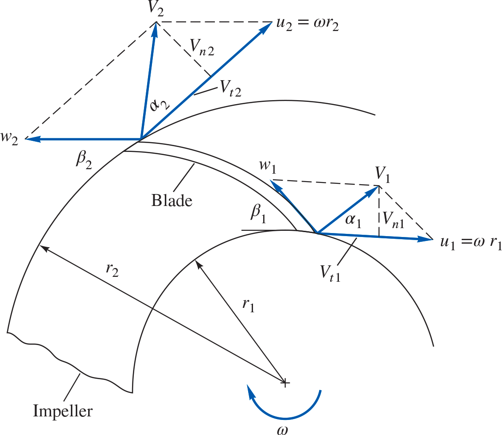
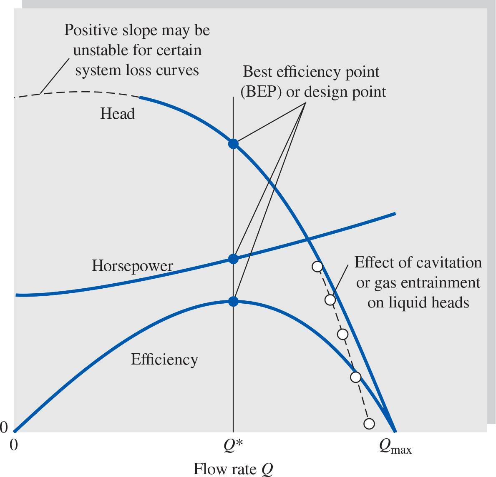
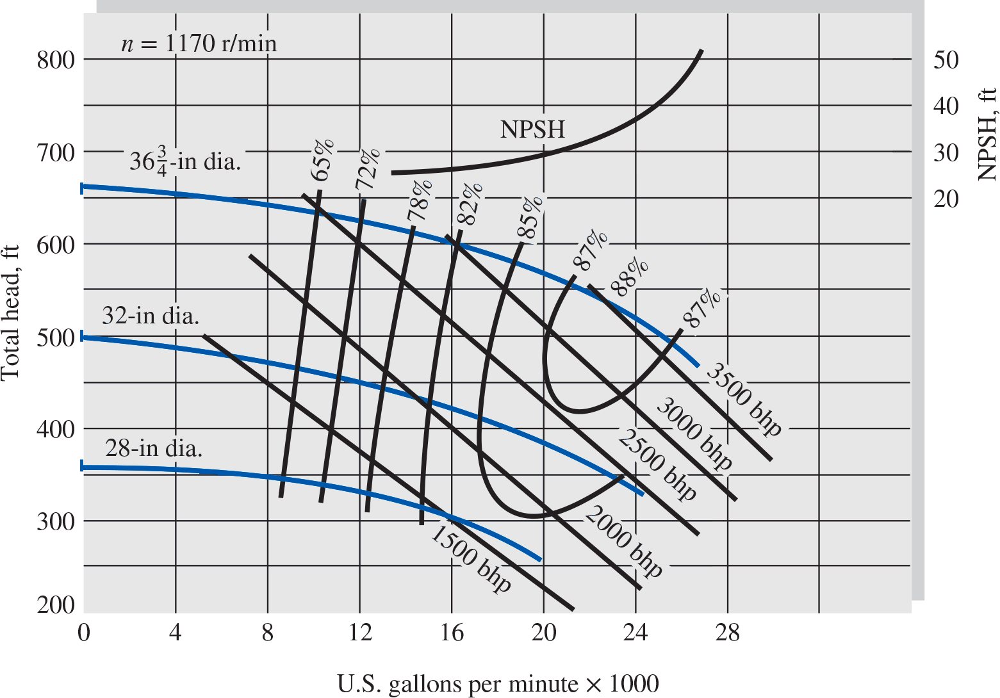

# MME 3303A: Fluid Mechanics II
## Unit 5: Turbomachinery
## Topic 2: Elementary Pump Theory and Pump Curves
Instructor: C.T. DeGroot, PhD, PEng  

---
<!-- Section 01: Topic Learning Objectives-->
## Topic Learning Objectives

- Understand elementary pump theory and velocity triangles.
- Be able to interpret pump performance curves.

---
<!-- Section 02: Elementary Pump Theory-->
## Elementary Pump Theory

- Energy analysis provides the relationships of the performance parameters.
- However, it does not provide insight into the process of work done by the pump on the fluid.
- The flow through the pump is complex and three-dimensional, making it difficult to analyze.
- To predict the head, power, efficiency, and flow rate of a pump, two theoretical approaches are possible: 
    - Simple one-dimensional approximations.
    - Complex three-dimensional computer models.

--
# Elementary Pump Theory

- In this section, we will study pump flow through *elementary pump theory*.
- Consider one-dimensional idealized flow through a typical blade passage.

--
## Velocity Triangle Components

- The fluid is assumed to enter the impeller at $r = r_1$, with an absolute velocity of $V_1$, which is a vector sum of the velocity of the blade, $U_1$, rotating in a circular path with angular velocity, $\omega$ ($U_1 = \omega r_1$), and the relative velocity $W_1$ tangent to the blade angle, $\beta_1$.

$$V_1 = U_1 + W_1$$

- Similarly, the flow exits at $r = r_2$, with the absolute velocity of $V_2$, which is a vector sum of blade velocity, $U_2 = \omega r_2$, and relative velocity $W_2$.

--
## Flow Assumptions

- The flow is assumed to be tangent to the blade surface when viewed from the reference frame rotating with the blade.
- $V_t$ is the absolute tangential velocity component of fluid.

--
<!-- .slide: class="student-only" -->
## Shaft Torque Derivation

- The shaft torque ($T_{\text{shaft}}$) required to rotate the pump impeller at steady state is equal to the difference between the outgoing and incoming angular momentum flux:

--
<!-- .slide: class="instructor-only" -->
## Shaft Torque Derivation

- The shaft torque ($T_{\mathrm{shaft}}$) required to rotate the pump impeller at steady state is equal to the difference between the outgoing and incoming angular momentum flux:

>- $\sum \vec{M}_0 = \vec{T}_\mathrm{shaft} = (\vec{r}_2 \times \vec{V}_2)\dot{m}_\mathrm{out} - (\vec{r}_1 \times \vec{V}_1)\dot{m}_\mathrm{in}$
>- The cross product of two vectors is: 
>- $\vec{a}\times\vec{b} = \|a\|\|b\|\sin\theta \vec{n}$ where $\theta$ is the angle between $\vec{a}$ and $\vec{b}$ and $\vec{n}$ is a unit vector perpendicular to $\vec{a}$ and $\vec{b}$ and directed according the the right-hand rule.
<!-- .element: class="annotation-space" -->

--
<!-- .slide: class="student-only" -->
## Shaft Torque Derivation

--
<!-- .slide: class="instructor-only" -->
## Shaft Torque Derivation

>- $\vec{r} \times \vec{V} = rV\sin\theta\hat{k} = rV\cos\alpha\hat{k} = rV_t\hat{k}$
>- Thus, $T_\mathrm{shaft} = (r_2 V_{t2})\dot{m} - (r_1 V_{t1})\dot{m}$ (where $\dot{m}_\mathrm{in} = \dot{m}_\mathrm{out}$) (magnitude)
> 
<!-- .element: class="annotation-space" -->

--
<!-- .slide: class="student-only" -->
## Shaft Torque Derivation

--
<!-- .slide: class="instructor-only" -->
## Shaft Torque Derivation

>- $T_{\mathrm{shaft}} = \rho Q(r_2 V_{t2} - r_1 V_{t1})$
>- $P_{\mathrm{shaft}} = \omega T_{\mathrm{shaft}} = \omega \rho Q(r_2 V_{t2} - r_1 V_{t1})$
>- $P_{\mathrm{shaft}} = \rho Q[(\omega r_2)V_{t2} - (\omega r_1)V_{t1}]$
>- $P_{\mathrm{shaft}} = \rho Q[U_2 V_{t2} - U_1 V_{t1}]$
>- Consider ideal case (no losses):
>- $P_{\mathrm{pump}} = P_{\mathrm{Shaft}}$
>- $H_{\mathrm{pump}} = \frac{P_{\mathrm{pump}}}{\rho g Q} = \frac{1}{g}[U_2 V_{t2} - U_1 V_{t1}]$
>- The equations for $P_{\mathrm{shaft}}$ and $h_{\mathrm{pump}}$ are known as the *Euler turbomachinery equations*
<!-- .element: class="annotation-space" -->

--
## Key Observations

- The equation shows that the pump head depends on the blade tip velocities ($U_1$, $U_2$) and the absolute fluid tangential velocities ($V_{t1}$, $V_{t2}$).
- The blade pushes the fluid in the tangential direction and exerts a tangential force on the fluid in the direction of motion of the blade.
- This tangential force component and the blade motion are in the same direction, so the blade does work on the fluid.

--
<!-- .slide: class="student-only" -->
## Radial Velocity Relations

- For a centrifugal pump, the shaft power can be related to the radial velocity ($V_n$) where,

--
<!-- .slide: class="instructor-only" -->
## Radial Velocity Relations

- For a centrifugal pump, the shaft power can be related to the radial velocity ($V_n$) where,

>- $V_n = V_t \tan\alpha \Rightarrow V_t = V_n \cot\alpha$
>- $P_{\mathrm{shaft}} = \rho Q(U_2 V_{n2}\cot\alpha_2 - U_1 V_{n1}\cot\alpha_1)$
>- From continuity:
>- $V_{n2} = \frac{Q}{2\pi r_2 b_2}, \quad V_{n1} = \frac{Q}{2\pi r_1 b_1}$
>- where $b_1$ and $b_2$ are blade widths (i.e. spacing between blades) at inlet and outlet.
>- There equations can be used to calculate the idealized power and head vs. discharge
<!-- .element: class="annotation-space" -->

--
## Design Flow Rate

- The design flow rate for a centrifugal pump is commonly estimated by assuming that the flow enters normal to the impeller, i.e.:

$$\alpha_1 = 90°, \quad \text{then,} \quad V_{t1} = 0 \text{ and } V_1 = V_{n1}$$

- This can usually give an estimate that is $\pm$20\%.

--
# Effect of Blade Angle

- Elementary pump theory can be used to predict blade-angle effects. - If we neglect inlet angular momentum, the theoretical water power is:

$$P_\mathrm{pump} = \rho Q U_2 V_{t2} $$

where 

$$V_{t2} = U_2 - V_{n2} \cot \beta_2 \qquad V_{n2} = \frac{Q}{2\pi r_2 b_2}$$

--

## Theoretical Head with Blade-Angle Effect

- Using the Euler turbomachinery equation:

$$ H_{\mathrm{pump}} = \frac{P_{\mathrm{pump}}}{\rho g Q} = \frac{\rho Q U_2 (U_2 - V_{n2} \cot \beta_2)}{\rho g Q} $$

$$H_{\mathrm{pump}} \approx \frac{U_2^2}{g} - \frac{U_2 V_{n2} \cot\beta_2}{g} = \frac{U_2^2}{g} - \frac{U_2 \cot\beta_2}{2\pi r_2 b_2 g} Q $$

- This shows that theoretical head decreases linearly with flow rate, with the slope determined by the blade angle $\beta_2$.

---
<!-- Section 03: Pump Performance Curves-->
## Pump Performance Curves and Similarity Rules

- Elementary pump theory is useful to understand some fundamental aspects of pump operation, but it is too simplified to provide reliable information about real performance.
- Thus, realistic information about a pump's performance is obtained through extensive testing which is presented in the form of performance curves.
- Typically the head rise (H), brake horse power (bhp) and pump efficiency ($\eta$) are plotted versus the discharge ($Q$) (independent variable) for constant shaft rotation speed.

--
## Pump Performance Curve

--
## Performance Curve Features

- The head is approximately constant at low discharge.
- Head decreases with an increase in discharge; this is predicted by the simplified equation we derived:

$$H_{\mathrm{pump}} = \frac{U_2^2}{g} - \frac{U_2 \cot\beta_2}{2\pi r_2 b_2 g} Q $$

- At this speed and impeller size, the pump cannot deliver any more fluid than $Q_{\max}$.
- The efficiency is always zero at $Q = 0$ and $Q = Q_{\max}$.
    - At $Q = Q_{\max}$ the pump generates no pressure rise so its efficiency is zero.
- It is desirable that the efficiency curves be flat near $\eta_{\max}$, so that a wide range efficient operation is achieved.

--
## Real Pump Performance Charts

--
## Real Pump Performance Charts

---
<!-- Section 04: iClicker Problem-->
<!-- .slide: class="instructor-only" -->
## iClicker Question

A centrifugal pump operates at constant speed. If the discharge (flow rate) increases, what happens to the head rise across the pump?

- A. Head rise increases
- B. Head rise remains constant
- C. Head rise decreases
- D. Head rise first increases then decreases

--
<!-- .slide: class="instructor-only" -->
## iClicker Question - Answer

**Answer: C**

*Explanation:* Based on the pump performance curves, as discharge (Q) increases, the head rise (H) typically decreases. This is a characteristic behavior of centrifugal pumps. At low discharge, the head is approximately constant, but as discharge increases, the head drops until it reaches zero at maximum discharge ($Q_{\max}$). This behavior is due to increased losses at higher flow rates, including friction losses and shock losses from flow mismatch at the blade angles.
